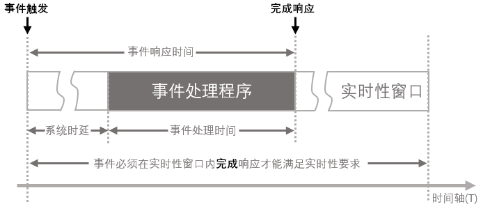
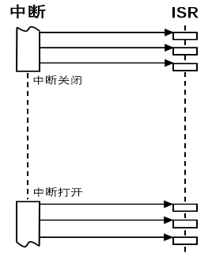
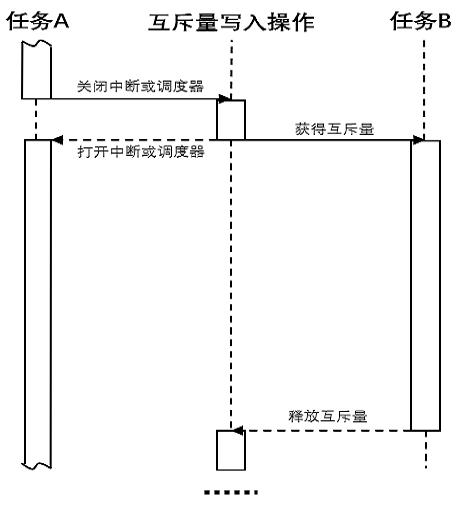
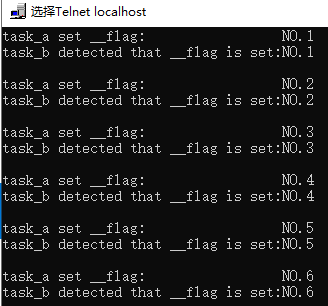
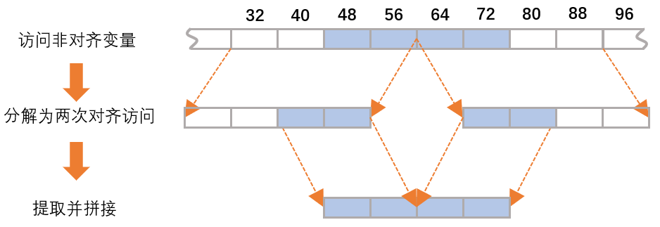
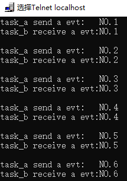
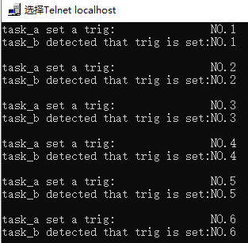
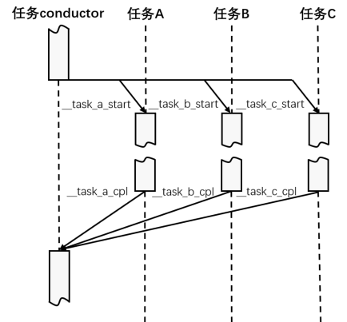
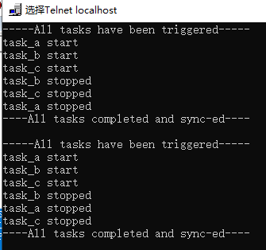
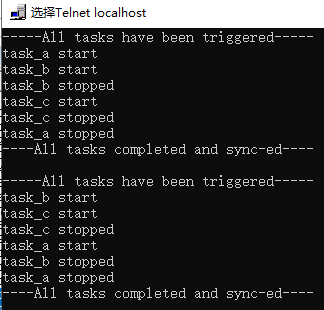

#  《IPC——多个Pt任务间如何进行触发和同步》  

##  1 本文档的目的及简介  
###  1.1 编写本文档的目的  

&emsp;&emsp;本文档将从如何安全的访问共享资源切入，逐步推导出VSF系统中使用IPC作为任务间通信介质的必要性及优越性，并且在此基础上对基于IPC实现的异步任务范式、基于IPC实现的同步任务范式、本文档所涉及的IPC的接口和语法进行详细的介绍，向用户系统的介绍在VSF系统中为什么以及如何使用IPC。

###  1.2 本文档解决哪些问题  

**阅读本文档您会获得以下问题的答案：**  

- 什么是共享资源  
- 多任务如何安全的访问共享资源
- 多任务使用什么方式访问共享资源是安全且弊端是最小的
- 什么是异步任务范式
- 如何使用VSF系统内的IPC实现异步任务范式
- 什么是同步任务范式
- 如何使用VSF系统内的IPC实现同步任务范式
- 本文档所涉及的VSF系统中的IPC的语法和使用示例

##  2 关于阅读本文档的若干约定  
###  2.1 在阅读本文档之前  

&emsp;&emsp;1.本文档所介绍的内容是在使用VSF的Pt模式进行简单开发的基础上实现多个Pt任务的IPC通信，因此用户阅读本文档前应当掌握如何使用VSF的Pt模式进行开发。

>- 若对VSF的Pt模式如何开发存有疑问，请阅读文档《VSF快速入门指南——使用Pt模式》。
>- 用户阅读本文档时我们默认用户已掌握VSF的Pt模式的开发方法。

&emsp;&emsp;2.这里需要强调的是：如文档标题所表，本文档的内容范围**仅限于如何使用VSF系统内的IPC进行任务的触发与同步**。读者如果希望了解VSF系统内有哪些IPC可以在任务间传递数据，以及如何使用这些IPC在任务间传递数据，请阅读文档《IPC——如何在多个Pt任务间传递数据》。

###  2.2 阅读本文档用户需具备的基础知识  

&emsp;&emsp;本文档所介绍的IPC基于VSF的Pt模式，VSF则是基于C语言，而这一切都是在嵌入式开发环境进行开发，因此阅读本文档的用户需要熟悉C语言编程以及嵌入式开发环境使用。

>- VSF支持MDK、IAR，Eclipse+GCC等常见开发环境，用户熟悉其中之一即可。
>- 用户阅读本文档时我们默认用户已经具备以上知识。

###  2.3 本文档涉及的部分关键名词  

| 名词 | 解释及约定   | 备注 |
| :--: | ------------ | ---- |
| ISR  | 中断服务程序 |      |
|      |              |      |

##  3 共享资源的访问  
###  3.1 什么是共享资源  

&emsp;&emsp;任何可以被任务访问的实体都可以称为**资源**，例如：变量、数组、结构体、CPU、EEPROM、显示器等。  

&emsp;&emsp;假如多个任务对**资源A**都有访问需求，那么**资源A**便是**共享资源**。  

>此处的**共享**是对于访问这个资源的任务而言的，就像共享单车是被使用它们的人们所**共享**。

###  3.2 多任务访问共享资源会带来什么问题  
####  3.2.1 数据访问的完整性问题  

&emsp;&emsp;导致数据安全问题的原因多种多样，但是根本原因都在于数据的完整性得不到保证。这里仅根据上小节讨论的共享资源问题从多任务交叉访问共享资源的角度举两个例子说明产生数据完整性问题的原因：  
&emsp;&emsp;示例：假设任务A和任务B同时访问共享资源——变量C，如果任务B执行读取操作进行到一半的时候被任务A的写入操作打断(如下图)，那么变量C被部分或者全部改写，变量C的数据完整性即被破坏了，任务B从任务切换点恢复执行后读取变量C得到的数据无疑是有问题的。   


>- 图中的方块代表的单个步骤均默认为一个不可打断的原子操作。  
>- 例1假设任务A写入操作需要一个步骤，任务B读取操作需要多个步骤。  

&emsp;&emsp;我们由上面的示例可以得到一个结论：**当多个任务同时访问一个共享资源，并且这些任务中存在由多个可打断步骤组成的读或写操作的时候，就会存在数据访问的完整性问题**。  

####  3.2.2 数据访问的竞争问题  

&emsp;&emsp;示例：假设任务A和任务B同时访问共享资源变量C，两个任务都希望将变量C自加1。在正确的逻辑下，A、B任务执行完毕后变量C应该在原有的数值上增加了2，但是在实际的运行中可能会出现以下情况：   

>CPU运行的指令:  
>>指令1：任务A读取变量C的值：x  
>>指令2：任务B读取变量C的值：x  
>>指令3：任务A改变读取到的值：将读取的值加1得到x+1  
>>指令4：任务B改变读取到的值：将读取的值加1得到x+1  
>>指令5：任务A将(x+1)写回变量C  
>>指令6：任务B将(x+1)写回变量C  

&emsp;&emsp;由以上示例可以看到由于数据访问存在竞争的情况，任务B读取的不是任务A改写完毕的变量C，而是初始值的变量C，这就会导致任务A、B最后写回变量C的数据都是x+1，最后的结果也就出现了逻辑性的错误，没有得到x+2。  

任务A、B对共享资源的访问情况如下：  


>- 图中的方块代表的单个步骤均默认为一个不可打断的原子操作。  
>- 例2假设任务A、B对变量C的操作均有**读-改-写**三个步骤，因为**改**这个步骤不涉及对共享资源的访问，因此不在图中进行体现。

###  3.3 多任务如何安全的访问共享资源  

&emsp;&emsp;上节我们讨论了多任务访问共享资源带来了哪些问题以及问题的成因，下面将介绍在各种情况下如何解决以上问题，并对几种方式进行比较。  

####  3.3.1 对共享资源的访问全部来自Pt任务时  

**1) 多个Pt任务均为同等优先级**  

&emsp;&emsp;在VSF系统中，同等优先级的任务不会相互抢占，此时不会存在某个任务正在执行的时候突然被其他任务打断的可能，因此这种情况下我们不需要对各个任务进行保护，它们天然情况下即是安全的。  

>这里不考虑中断打入的情况，默认为没有ISR，只有同优先级Pt任务。

**2) 多个Pt任务为不同优先级**  

&emsp;&emsp;此时存在任务正在执行的时候突然被其他高优先级任务打断的可能，而这个打断可能就会产生不合时宜的写入操作，这无疑是存在风险的。在这种情况下，我们可以从根本上解决这一问题：  
&emsp;&emsp;在某个任务即将执行到用户任务的关键语句的时候**关闭调度器**，使高优先级任务不具备打断低优先级任务的能力，当用户任务的关键语句执行完毕后将**调度器重新打开**，恢复VSF系统的正常调度功能。这样，关键操作的原子性得到了保证，自然数据的完整性得到了保证。  

示例：  

```
implement_vsf_pt(user_pt_a_t) 
{
    vsf_pt_begin();

    while(1) {
        ...

        this.origlevel = vsf_protect_sched();  /*关闭调度器*/

        read();  /*两个不希望被打断的读取操作步骤*/
        read();

        vsf_unprotect_sched(this.origlevel);  /*打开调度器*/
        ...

    }

    vsf_pt_end();
}
```

>- ***origlevel*** 是 ***user\_pt\_a\_t*** 的成员变量。
>- 以上讨论建立在**只有高优先级任务会打断低优先级任务**的情况下，不考虑中断打入的情况，默认没有ISR。

**3) 关于成员变量origlevel**  

&emsp;&emsp;在上面的示例代码中出现了一个变量 ***origlevel*** ，这里我们解释一下这个变量存在的必要以及意义：  
&emsp;&emsp;**实际开发中**产品逻辑复杂，调度器进行开关操作的时候可能会涉及到**调度器操作的嵌套问题**，例如：某个时刻，任务A中关闭了调度器，计划在若干个关键操作完成后再打开调度器，这些关键操作中包含对某个接口(API)的调用，而在这个API中也进行了一次**关—>开**调度器的操作，那么等任务A被唤醒接着执行剩下的关键步骤的时候调度器是打开的，这里显然和我们预期的保护时间有了偏差。这种情况的示意如下：  


&emsp;&emsp;对于这种情况，VSF规定开调度器和关调度器必须是一一对应的，这便是 ***origlevel*** 的用处——用于保存关调度前的状态以便开调度时进行对应。

####  3.3.2 对共享资源的访问分别来自ISR和Pt任务时  

&emsp;&emsp;在此情况下，Pt任务可能会在任何时间点被ISR打断，这里可能会产生不合时宜的写入操作，这种情况同样存在未知的风险。这种情况下，我们也是可以从根本上解决这一问题：  
&emsp;&emsp;在某个任务即将执行到用户任务的关键语句的时候**关闭中断**，使ISR不再能再响应中断，这样就不存在用户任务的关键语句被打断的可能，当用户任务的的关键语句执行完毕之后将**中断重新使能**，恢复ISR对中断的响应。可以看到，关键操作的原子性同样得到了保证。  

示例：  

```
implement_vsf_pt(user_pt_a_t) 
{
    vsf_pt_begin();

    while(1) {
        ...

        this.origstate = vsf_disable_interrupt();  /*关闭中断*/

        read();  /*两个不希望被打断的读取操作步骤*/
        read();

        vsf_set_interrupt(this.origstate);        /*打开中断*/
        ...

    }

    vsf_pt_end();
}
```

>- ***origlevel*** 是 ***user\_pt\_a\_t*** 的成员变量。
>- 以上讨论建立在**只有ISR会打断任务**的情况下。
>- 需要注意的是：**在VSF系统中，中断处理程序(ISR)的优先级不一定比调度器中的任务优先级高**。
>- 此处应当**注意**：以上讨论是针对指定的情况，关闭中断并**不能百分之百保证**需要保护的操作拥有原子性，例如：对用户任务的关键语句的打断来自硬件。对于实际的情况需要进行实际的分析，对症下药(具体方法超出本文讨论的范围，这里不再展开)，**不能**一味倚仗关闭中断去解决问题。
>- 此处成员变量 ***origstate*** 的使用和上文提到的 ***origlevel*** 目的一致，不过 ***origstate*** 是为了保证开关中断的对应。原因可以参见上文的**调度器操作的嵌套问题**，开关中断同样存在这方面的问题。

####  3.3.3 什么情况下需要开关调度器或者中断  

&emsp;&emsp;在很多保护共享资源的情景下，需要关闭调度器或者中断才能最大限度的保证关键操作的原子性。那么在什么情况下需要关闭调度器？什么情况下又该关闭中断？下表给出了答案：  

| 操作对象 | 对应的场景                            |
| :------: | ------------------------------------- |
|  调度器  | 只有多个任务访问共享资源的时候        |
|   中断   | 任何时候只要有ISR参与的共享资源的访问 |

###  3.4 为什么在VSF系统中推荐使用IPC  
####  3.4.1 上一节介绍的保护共享资源的方式存在什么弊端  

**1) 实时性与实时性窗口**  

&emsp;&emsp;要想理解直接开关中断或者开关调度的弊端，我们首先要了解什么是"实时性(Realtime)"以及一个重要的概念"实时性窗口"(Realtime Window)"。  
&emsp;&emsp;**实时性**的概念可以参照下图示意。我们可以看到**实时性窗口**的开始是从**事件触发**开始的，这个窗口是判断实时性是否达到需求的硬性指标。图中的深灰色部分代表事件处理程序需要的运行时间，我们将其称为**事件处理时间**。我们可以将图中的**事件处理程序**所处的位置后移到**完成响应**的时间点正好在实时性窗口的最后，可以看到，从**实时性窗口**总的时间中扣除**事件处理时间**就是满足系统**实时性**情况下的可以容忍的最大**系统时延**，换句话说，当**系统时延**再大时，**事件处理程序**已经来不及处理事件了。从图中可以看出，**事件响应时间**最小值等于**事件处理时间**(系统时延为0)，最大值就是**实时性窗口**。  



**2) 为什么以及产生了哪些弊端**  

&emsp;&emsp;可以看出，上一节所介绍的两种保护共享资源的方式(关调度、关中断)都是使共享资源被用户任务的关键语句独占，使得其他操作在任何情况都不能与用户任务的关键语句争夺共享资源，必须等到用户任务的关键语句执行完毕才能对共享资源进行访问。这样的做法可以妥善的保护共享资源的数据的完整性，但是我们也应该注意到这里面所隐含的陷阱：  
&emsp;&emsp;如果用户任务的关键语句比较长，需要执行的操作比较多，那么无论是关调度或者是关中断，较长时间的关闭都会导致除了用户任务的关键语句所在的任务外的其他任务或者ISR迟迟得不到执行。任务特别是ISR不到及时执行极有可能会导致系统的响应超出预期，甚至是对事件的处理失败。  

&emsp;&emsp;从上面的分析我们可以得到一个结论：如果只简单粗暴的使用关调度或者关中断的方式去解决多任务访问共享资源造成的数据完整性问题，可能会导致任务在**实时性窗口**内不能完成需要完成的操作，即系统出现**实时性**问题。  

&emsp;&emsp;如果我们在系统中使用了一个定时器中断，每次中断都有对应的ISR响应，我们的目的是每隔第一个固定的时间进行一次用户操作。在关闭中断后可以看到原来稳定响应的ISR停止了执行，ISR内的操作自然也不会继续了，这便是系统的实时性问题：  



####  3.4.2 如何将上文所提到的弊端造成的影响尽量减小  

**1) 应当采用什么样的思路去解决问题**  

&emsp;&emsp;既然问题的根源在于关调度或者关中断的时间是不确定的且可能是过长的，那么我们有没有办法通过确定的且很短的关闭时间来“以小换大”呢？如果通过对一个变量进行原子性(由关调度或者关中断来提供保障)的操作，使这个变量具有互斥性，那么我们就可以利用这个互斥性变量来实现临界区，这样进行操作之后临界区的跨度完全与关调度时间、关中断时间脱钩，实时性问题自然不复存在了。  

思路示意如下：  



**2) 采用上述思路的方案是否可行**

&emsp;&emsp;首先，如果我们按照上面的思路进行实现，我们将获得什么，又需要付出什么代价：  

- 收益：关调度、关中断的时间(对一个变量进行原子操作的时间)短暂且确定。  
- 代价：稍微增加的代码尺寸、稍微被拉低的执行效率(完全在可以接受的范围内，几乎无影响)。  

&emsp;&emsp;通过上面的对比我们可以看出通过额外付出极小的代价，便可以获得一个稳定可行的妥善保护共享资源的方式。这种方式解决了如何**保护共享资源**的问题，也不会带来上面提出的系统**实时性**问题，可以说在各种需求之间找到了一个平衡。  

####  3.4.3 如何在共享资源的保护上"以小换大"  

&emsp;&emsp;在VSF系统中有一个名为**临界区变量**的IPC—— ***vsf\_crit\_t*** 类， ***vsf\_crit\_t*** 类在VSF系统中是专用于实现临界区的，而临界区的作用正是保护共享资源的安全。我们可以发现“以小换大”的思路是非常符合 ***vsf\_crit\_t*** 类的应用场景的，实际中 ***vsf\_crit\_t*** 类也正是这么实现的。可以见得，系统提供的IPC已经是保护共享资源的最优解，这也是推荐任务间通信使用IPC的原因之一。  

>在VSF的系统中，为建立临界区提供了关于 ***vsf\_crit\_t*** 类的一系列接口：  
>- vsf\_crit\_init  
>- vsf\_crit\_enter  
>- vsf\_crit\_leave

下面将使用例子介绍如何构建一个临界区：  

```
/*定义一个临界区变量__crit_variable*/
static NO_INIT vsf_crit_t __crit_variable;

/*初始化__crit_variable*/
vsf_crit_init(&__crit_variable);

implement_vsf_pt(user_pt_a_t) 
{
    vsf_pt_begin();

    while(1) {
        vsf_crit_enter(&__crit_variable);   /*尝试进入临界区*/

        /*临界区：放入我们需要保护的共享资源*/   

        vsf_crit_leave(&__crit_variable);   /*离开临界区*/
    }

    vsf_pt_end();
}
```

>在VSF环境下，由NO_INIT修饰的变量，不仅不能携带初始值，编译器也将不会对其进行清零操作。这样可以避免芯片启动时对不必要初始化的变量进行默认的清零操作（编译器一般默认会在初始化的过程中对ZI段内的变量进行默认清零操作），加快芯片启动速度。

##  4 如何使用IPC实现异步任务范式  
###  4.1 什么是异步任务范式  

&emsp;&emsp;VSF系统提供了专门的触发类(vsf\_trig\_t)在任务间 单向的传递触发信号 。 ***vsf\_trig\_t*** 类在使用时根据触发信号复位的方式不同分为自动复位(Auto Reset)和手动复位(Manual Reset)两种模式。为了方便大家的理解，下文将以常见的"异步任务范式"为例，为您介绍两种模式的具体使用方法。

>异步任务范式描述的是这样一种使用情景：
>
>- 为了实现某一个功能或服务，我们设计并实现了一个专门的任务
>- 该任务在完成了初始化后，等待一个专门的触发信号来启动后续的任务
>- 可选的，当对应功能或服务完成后，该任务会通过另外一个专门的触发信号将“任务已完成”的信息告知外界。
>- 在这个过程中，任务只专注于用于启动和报告完成的触发信号以及所要实现的功能和服务本身，而并不关心究竟是谁（哪个任务）发出了启动的触发信号，也不关心完成信号究竟被谁所接收。
>
>异步任务范式的最简单形式如下图所示：
>
>任务A通过 ***\_\_task\_start*** 触发任务B后挂起等待完成信号 ***\_\_task\_cpl*** ，当任务B被触发且运行完成后置位 ***\_\_task\_cpl*** ，重新触发任务A继续运行。


###  4.2 如何实现异步任务范式  
####  4.2.1 使用静态变量进行任务间通信  

**1) 如何使用静态变量进行任务间通信**  

&emsp;&emsp;首先定义一个**bool**型的静态变量 ***\_\_flag*** ，并将它初始化为false。  

    static bool __flag = false;  

&emsp;&emsp;然后定义任务类型并创建任务启动函数。在任务类中我们定义一个计数器成员变量(cnt)。

```
declare_vsf_pt(user_pt_a_t)

def_vsf_pt(user_pt_a_t,

    features_used(
        mem_sharable( )
        mem_nonsharable( )
    )

    def_params(
        uint32_t cnt;
    )
)

declare_vsf_pt(user_pt_b_t)

def_vsf_pt(user_pt_b_t,

    features_used(
        mem_sharable( )
        mem_nonsharable( )
    )

    def_params(
        uint32_t cnt;
    )
)

void vsf_kernel_flag_simple_demo(void)
{               
    {
        static NO_INIT user_pt_a_t __user_task_a;
        __user_task_a.on_terminate = NULL;
        __user_task_a.param.cnt = 0;              /*将计数器初始化为0*/
        init_vsf_pt(user_pt_a_t, &__user_task_a, vsf_prio_0);
    }

    {
        static NO_INIT user_pt_b_t __user_task_b;
        __user_task_b.on_terminate = NULL;
        __user_task_b.param.cnt = 0;              /*将计数器初始化为0*/
        init_vsf_pt(user_pt_b_t, &__user_task_b, vsf_prio_0);
    }
    
}
```

>- 在VSF环境下，由NO_INIT修饰的变量，不仅不能携带初始值，编译器也将不会对其进行清零操作。这样可以避免芯片启动时对不需要默认初始化的变量进行清零操作（编译器一般会在初始化的过程中对ZI段内的变量进行默认清零操作），从而加快芯片启动速度。  

>- Thread任务结束之后会通过一个函数指针成员( ***on\_terminate*** )调用用户对Thread任务进行"善后"的函数，例如，资源释放。对于这个函数指针有以下几点需要读者注意：
>
>>- 此函数指针不能为一个不确定值，不然易造成死机。因此，我们没有"善后"函数的时候，需要将其手动赋值为 ***NULL*** ，或者不使用NO_INIT修饰Thread实例，让编译器和芯片对其进行初始化。我们推荐读者使用第一种方法。
>>- 用户的"善后"函数内部不可以存在阻塞的代码。

&emsp;&emsp;假设任务B被任务A触发才能执行，任务A每一秒触发一次，任务B被触发一次执行一次，打印的log可以用来确定触发与响应是否对应。使用__flag作为任务间通信的介质。  

```
implement_vsf_pt(user_pt_a_t) 
{
    vsf_pt_begin();

    while(1) {
        __flag = true;                                   /*置位__flag*/
        this.cnt++;                                      /*计数器自加*/
        printf("task_a set __flag:                      NO.%d\r\n", this.cnt);  
                                                         /*打印log*/  
        vsf_pt_wait_until(vsf_delay_ms(1000));           /*延时一秒*/
    }

    vsf_pt_end();
}

implement_vsf_pt(user_pt_b_t) 
{
    vsf_pt_begin();

    while(1) {
        if(__flag != false) {                           /*如果__flag被置位则进if*/
            this.cnt++;                                 /*成员变量自加*/
                                                        /*打印log*/
            printf("task_b detected that __flag is set:NO.%d\r\n\r\n", 
                   this.cnt);
            __flag = false;                             /*复位__flag*/
        }

        /*隔一段时间检测一次，防止CPU被此任务独占*/
        vsf_pt_wait_until(vsf_delay_ms(10));      
    }

    vsf_pt_end();
}

int main(void)
{
    ...
    vsf_stdio_init();               /*初始化VSF的标志输入输出库*/

    vsf_kernel_flag_simple_demo();  /*启动任务*/
    ...
    while(1) {
        ...
        vsf_delay_ms(1000);
    }
}
```

>- main函数不为Pt模式。
>- 这里只对本文档着重介绍的部分进行注解，若对未注解的代码的语法及使用方式存有疑问请参考本文档2.1章节所述。

运行结果：  

>演示工程为FVP工程。



**2) 什么情况下使用静态变量进行任务间通信是安全的**  

&emsp;&emsp;使用静态变量进行任务间通信即代表静态变量需要被多个任务访问，因此静态变量在这种情况下就是共享资源，如何安全的使用静态变量进行任务间通信实际上需要考虑的问题就是如何保护静态变量这个**共享资源**。根据上文对共享资源的讨论，我们可以得到以下结论：  

|        任务类型        | 是否为单步骤通信操作 | 是否可以使用静态变量做任务间通信 |
| :--------------------: | :------------------: | :------------------------------: |
|  仅同优先级Pt任务  |          是          |                是                |
|                        |          否          |                是                |
| 仅不同优先级Pt任务 |          是          |                是                |
|                        |          否          |                否                |
|  Pt任务与ISR通信   |          是          |                是                |
|                        |          否          |          不存在这种情况          |

>Pt任务与ISR通信时只能是ISR向Pt任务单向发送信息。

&emsp;&emsp;需要强调的是上面提到的**静态变量**在上面讨论的环境中使用的话必须具有**天然原子性**。**天然原子性**是指变量被访问的时候整个访问过程具有天生的不可被打断的特性。这里我们对**天然原子性**展开解答一个问题——什么样的变量具有**天然原子性**？
&emsp;&emsp;首先，我们给出结论，一个变量想要具有**天然原子性**必须满足以下条件：  

&emsp;&emsp;**1.被访问的变量的类型长度小于等于机器字长。**  

&emsp;&emsp;**2.被访问的变量的起始地址必须对齐到该变量类型长度的整数倍位置，即要求对齐访问。**  

&emsp;&emsp;第一个条件很好理解，不是一气合成的操作就存在被打断的可能，而CPU访问类型长度大于机器字长的变量的时候就必须分为至少两次读取才能读取到完整的数据，比如8位机读取16位类型长度的变量。  

&emsp;&emsp;关于第二个条件，我们首先明确很多CPU都不支持直接进行非对齐访问，这并不代表这些CPU不能进行非对齐访问，而是采用在目标内存前后对齐地址多次对齐的访问内存后再提取数据进行拼接的方式来访问非对齐变量的内存(示意如下图)，这无疑会带来性能的损失，更为致命的是多次访问操作意味着对一个变量的内存访问存在被打断的可能性。  



>- 图中一个方格代表一个**字节**(1Byte)，方格顶上的数字表示该方格代表的内存的起始值。
>- 图中设定的场景32位机访问32位类型长度的非对齐变量内存。  

&emsp;&emsp;这里我们再发散一下，有没有在现在主流的应用环境(使用8位及以上机器字长的CPU)下一定具有**天然原子性**的变量呢？答案是肯定的，那就是**int8\_t**和**uint8\_t**类型的变量。这两种类型在主流的应用环境下条件一是满足的，而内存(memory)的最小单位是**字节**(1Byte = 8Bit)，操作的地址必然是8的整倍数，显然条件二也被满足了。

**3) 使用静态变量进行任务间通信的优缺点**  

&emsp;&emsp;由上面的表格可以看出使用静态变量做任务间通信并不是完全的不可行、不安全，在一些特定的情况下使用静态变量做通信也是完全稳妥的。  

下面对使用静态变量做任务间通信的优缺点给出总结:  

|      |                                                  |
| :--: | :----------------------------------------------: |
| 优点 | 占用资源最少；不会有额外的操作拉低系统的运行效率 |
| 缺点 |                   不能阻塞任务                   |

&emsp;&emsp;由上面的对比可以看出，使用静态变量做任务间通信限制很多，需要注意的地方都是要害，一旦出错就会明显得拉低开发效率，并且在有些情况下是没有办法使用静态变量进行任务间通信的。对于用户来说可以简单稳定的进行开发才是最为重要的，使用静态变量做任务间通信会使开发过程变得繁琐且存在风险，这显然是不符合用户需求的。VSF系统中的IPC正是为了解决这些痛点，用户只需要知道IPC的接口以及这些接口该如何使用即可，这些都是确定且稳定的，这也是**任务间通信推荐IPC而不推荐静态变量**的主要原因。  

####  4.2.2 使用post_evt(发送事件)  

**1) 什么是事件驱动架构(EDA)**  

&emsp;&emsp;传统的编程方式是以接口为媒介，即调用者是知道被调用者的存在，他们是通过接口进行耦合的，一旦接口发生改变，双方都需要改动，而事件驱动的方式则是调用者和被调用者互相不知道对方的存在，两者只和中间的消息队列耦合，通过中间的消息队列进行沟通。事件驱动架构便是一种以事件为载体、以消息队列为媒介，实现组件和服务之间最大松耦合的方式。  

&emsp;&emsp;VSF系统是基于事件驱动架构运作的，因此我们有机会在任务线程层面进行事件(evt)的发送，直接驱动其他的任务。  

VSF系统在Pt模式下提供了以下接口给用户直接操作事件：  

- vsf\_pt\_sendevt
- vsf\_pt\_wfe

>- 这里只列出本文档示例使用的两个接口，为不完全列举。  
>- 如果希望获得关于Pt模式中操作事件的全部接口请浏览 ***vsf\_pt.h*** 文件。

**2) 如何使用post\_evt进行任务间通信**  

&emsp;&emsp;首先，在使用我们自己的事件的时候需要自定义一个用户事件，事件的定义是使用枚举来做的。如果我们需要定义一个名为 ***VSF\_EVT\_START*** 的用户事件，则应当如下操作：  

    enum{
        VSF_EVT_START = VSF_EVT_USER + 1,
    }vsf_user_evt_t;

>用户在定义自己的事件的时候需要注意的是，自定义的事件枚举大小必须在**VSF_EVT_USER**的基础上往后取值。

&emsp;&emsp;然后，定义任务类型并创建任务启动函数，同时在任务启动函数内部需要获得接收事件的实例指针(一般在实例初始化的时候进行获取较为方便)。  

```
declare_vsf_pt(user_pt_a_t)

def_vsf_pt(user_pt_a_t,

    features_used(
		mem_sharable()
		mem_nonsharable()
	)

	def_params(
		vsf_pt_t *pt_obj;
        uint32_t     cnt;
    )
)

declare_vsf_pt(user_pt_b_t)

def_vsf_pt(user_pt_b_t

    features_used(
        mem_sharable( )
        mem_nonsharable( )
    )

    def_params(
        uint32_t cnt;
    )
)

void vsf_kernel_post_evt_simple_demo(void) 
{
    /*定义一个vsf_pt_t类型的局部变量指针*/
    vsf_pt_t *target_pt;                                      

    {
        static NO_INIT user_pt_b_t __user_task_b;           
        __user_task_b.on_terminate = NULL;      
        __user_task_b.param.cnt = 0;             /*初始化实例的成员变量*/
        target_pt = (vsf_pt_t *)&__user_task_b;  /*获取实例指针*/
        init_vsf_pt(user_pt_b_t, &__user_task_b, vsf_prio_0); 
    }

	{
		static NO_INIT user_pt_a_t __user_task_a;          
        __user_task_a.on_terminate = NULL;     
        __user_task_a.param.cnt = 0;             /*初始化实例的成员变量*/

        /*将任务B的实例指针赋给任务A的成员变量*/
    	__user_task_a.param.pt_obj = target_pt;  
    	init_vsf_pt(user_pt_a_t, &__user_task_a, vsf_prio_0); 
    }    
}

```

>若读者对修饰符 ***NO_INIT*** 或者 ***xxx.on_terminate = NULL*** 语句存有疑问，请参考本文档4.2.1章节第一小节内的说明。

&emsp;&emsp;假设任务B被任务A触发才能执行，任务A每一秒触发一次，任务B被触发一次执行一次，打印的log可以用来确定触发与响应是否对应。使用事件(evt)作为任务间通信的介质。  

```
implement_vsf_pt(user_pt_a_t) 
{
    vsf_pt_begin();

    while(1) {
        /*对目标任务发送一个指定事件*/
        vsf_pt_sendevt(this.pt_obj, VSF_EVT_START);  
        this.cnt++;                                          /*计数器自加*/
        printf("task_a post a evt:   NO.%d\r\n", this.cnt);  /*打印log*/
        vsf_pt_wait_until(vsf_delay_ms(1000));               /*延时一秒*/
    }

    vsf_pt_end();
}

implement_vsf_pt(user_pt_b_t) 
{    
    vsf_pt_begin();

    while(1) {
        vsf_pt_wait_until(vsf_pt_wfe(VSF_EVT_START));            /*等待指定事件*/
        this.cnt++;                                              /*计数器自加*/
        printf("task_b receive a evt:NO.%d\r\n\r\n", this.cnt);  /*打印log*/   
    }

    vsf_pt_end();
}

int main(void)
{
    ...
    vsf_stdio_init();                   /*初始化VSF的标志输入输出库*/

    vsf_kernel_post_evt_simple_demo();  /*启动任务*/
    ...
    while(1) {
        ...
        vsf_delay_ms(1000);
    }
}
```

>- main函数不为Pt模式。
>- 这里只对本文档着重介绍的部分进行注解，若对未注解的代码的语法及使用方式存有疑问请参考本文档2.1章节所述。

运行结果：  

>演示工程为FVP工程。 



####  4.2.3 使用vsf\_trig\_t类  

&emsp;&emsp;首先，在使用vsf\_trig\_t类之前，我们需要定义几个使用vsf\_trig\_t类需要的宏。  

    #define SET     true   /*置位*/
    #define RESET   false  /*复位*/
    #define AUTO    true   /*自动复位*/
    #define MANUAL  false  /*手动复位*/

&emsp;&emsp;然后我们就可以开始定义并初始化vsf\_trig\_t类型的变量。  

    /*定义trig变量__trig_start*/
    static NO_INIT vsf_trig_t __trig_start;     
    
    /*初始化__trig_start初始状态为复位、自动复位*/
    vsf_trig_init(&__trig_start, RESET, AUTO);    

>在VSF环境下，由NO_INIT修饰的变量，不仅不能携带初始值，编译器也将不会对其进行清零操作。这样可以避免芯片启动时对不必要初始化的变量进行默认的清零操作（编译器一般默认会在初始化的过程中对ZI段内的变量进行默认清零操作），加快芯片启动速度。

&emsp;&emsp;当关于vsf\_trig\_t类的准备工作完成之后，我们便可以开始定义任务类型并创建任务启动函数，在定义实例时需要把\_\_trig\_start的地址赋给实例内的成员变量，以便任务内使用。  

```
declare_vsf_pt(user_pt_a_t)

def_vsf_pt(user_pt_a_t,

    features_used(
        mem_sharable( )
        mem_nonsharable( )
    )
  
    def_params(
        vsf_trig_t *set_trig;
    )
)

declare_vsf_pt(user_pt_b_t)

def_vsf_pt(user_pt_b_t,

    features_used(
        mem_sharable( )
        mem_nonsharable( )
    )

    def_params(
        vsf_trig_t *wait_trig;
    )
)

void vsf_kernel_trig_simple_demo(void)
{
    {
        static NO_INIT user_pt_a_t __user_task_a;   
        __user_task_a.on_terminate = NULL;

        /*将__trig_start地址赋给成员变量*/
        __user_task_a.param.set_trig  = &__trig_start;  
        init_vsf_pt(user_pt_a_t, &__user_task_a, vsf_prio_0);  
    }

    {
        static NO_INIT user_pt_b_t __user_task_b;   
        __user_task_b.on_terminate = NULL;

        /*将__trig_start地址赋给成员变量*/
        __user_task_b.param.wait_trig  = &__trig_start; 
        init_vsf_pt(user_pt_b_t, &__user_task_b, vsf_prio_0);  
    }
}
```

>若读者对修饰符 ***NO_INIT*** 或者 ***xxx.on_terminate = NULL*** 语句存有疑问，请参考本文档4.2.1章节第一小节内的说明。

&emsp;&emsp;在完成上面的步骤之后，就可以开始使用 ***\_\_trig\_start*** 进行任务间通信。假设任务B被任务A触发才能执行，任务A每一秒触发一次，任务B被触发一次执行一次，打印的log可以用来确定触发与响应是否对应。使用 ***vsf\_trig\_t*** 类的变量作为任务间通信的介质。  

```
implement_vsf_pt(user_pt_a_t) 
{
    vsf_pt_begin();

    while(1) {
        vsf_trig_set(this.set_trig);                      /*置位trig*/
        this.cnt++;                                       /*计数器自加*/
        printf("task_a set a trig:               NO.%d\r\n", this.cnt);  
                                                          /*打印log*/            
        vsf_pt_wait_until(vsf_delay_ms(1000));            /*延时一秒*/
    }

    vsf_pt_end();
}

implement_vsf_pt(user_pt_b_t) 
{
    vsf_pt_begin();

    while(1) {
        vsf_pt_wait_until(vsf_trig_wait(this.wait_trig)); /*等待trig被置位*/
        this.cnt++;                                       /*计数器自加*/
        printf("task_b detected that trig is set:NO.%d\r\n\r\n", this.cnt);  
    }                                                     /*打印log*/

    vsf_pt_end();
}

int main(void)
{
    ...
    vsf_stdio_init();               /*初始化VSF的标志输入输出库*/

    vsf_kernel_trig_simple_demo();  /*启动任务*/
    ...
    while(1) {
        ...
        vsf_delay_ms(1000);
    }
}
```

>- main函数不为Pt模式。
>- 这里只对本文档着重介绍的部分进行注解，若对未注解的代码的语法及使用方式存有疑问请参考本文档2.1章节所述。

运行结果：  

>演示工程为FVP工程  



##  5 如何使用IPC实现同步任务范式  
###  5.1 什么是同步任务范式  

&emsp;&emsp;当存在多个任务同时运行的情况下，我们应该假设每个任务的执行时间都是不尽相同的——即便多个任务同时开始运行，它们的完成时间也是不同的。在一些应用场景下，某些任务<u>必须要</u>等待多个任务全都完成后才能开始运行（比如这个任务需要前面多个任务提供的全部信息），此时，我们需要引入某种多任务间的同步范式，以实现这样的功能，这里我们不妨简单的称之为“多任务同步范式”。 

>多任务同步范式描述的是这样一种情形：
>
>- 存在多个任务，他们的执行时间是任意的，他们的起始执行时间是任意的
>- 由于功能上的需要，某些任务必须等待上述所有的这些任务全都完成后才可以开始执行
>- 需要通过某种任务间的同步机制监测目标任务是否完成——当所有目标任务都完成时，产生一个信号，告知等待中的任务
>
>为了演示方便，我们不妨引入一个用于协调的conductor任务、以及三个使用“异步任务范式”的服务任务A、B和C。假设应用场景为任务conductor启动任务A、B、C后打印触发完成信息，并等待来自任务A、B、C的完成信号；当任务A、B、C都运行完成后触发任务conductor打印多任务同步信息。  

对应的事件触发图如下：  



###  5.2 如何实现同步任务范式  
####  5.2.1 使用vsf_trig_t类  

&emsp;&emsp;假设有Pt任务A、B、C，这三个任务同时被触发，并且均在开始运行后进入延时，各个任务的延时时间由随机数发生器决定(即各个任务延时时间是随机的，模拟不同任务运行完毕需要不同的时间)。当main函数(Thread模式)得到A、B、C三个任务都执行完毕的信息(完成一次同步)后再次触发这三个任务，进入下一个周期。  

&emsp;&emsp;首先，使用vsf\_trig\_t类我们需要定义相关的宏。  

    #define SET     true   /*置位*/
    #define RESET   false  /*复位*/
    #define AUTO    true   /*自动复位*/
    #define MANUAL  false  /*手动复位*/

&emsp;&emsp;然后我们需要定义一系列的vsf\_trig\_t类型的变量并将它们初始化。  

    /*定义main函数向A、B、C任务通信的trig*/
    static NO_INIT vsf_trig_t __trig_start_a;     
    static NO_INIT vsf_trig_t __trig_start_b;
    static NO_INIT vsf_trig_t __trig_start_c;
    
    /*定义A、B、C任务向main函数通信的trig*/
    static NO_INIT vsf_trig_t __trig_cpl_a;       
    static NO_INIT vsf_trig_t __trig_cpl_b;
    static NO_INIT vsf_trig_t __trig_cpl_c;
    
    /*用于触发任务的trig初始化为复位、自动复位*/
    vsf_trig_init(&__trig_start_a, RESET, AUTO); 
    vsf_trig_init(&__trig_start_b, RESET, AUTO);
    vsf_trig_init(&__trig_start_c, RESET, AUTO);
    
    /*用于返回任务完成状态的trig初始化为复位、手动复位*/
    vsf_trig_init(&__trig_cpl_a, RESET, MANUAL); 
    vsf_trig_init(&__trig_cpl_b, RESET, MANUAL);
    vsf_trig_init(&__trig_cpl_c, RESET, MANUAL);  

>- 用于返回任务完成状态的vsf\_trig\_t类型的变量初始化为**手动复位**的目的是为了同步任务。
>- 在VSF环境下，由NO_INIT修饰的变量，不仅不能携带初始值，编译器也将不会对其进行清零操作。这样可以避免芯片启动时对不必要初始化的变量进行默认的清零操作（编译器一般默认会在初始化的过程中对ZI段内的变量进行默认清零操作），加快芯片启动速度。

&emsp;&emsp;在定义任务类型后，我们便可以在任务启动函数中把这些需要使用的 ***vsf\_trig\_t*** 类型的变量的地址初始化给各个实例的成员变量(一般是在实例创建之后即刻对实例进行初始化)。  

```
declare_vsf_pt(user_pt_a_t)

def_vsf_pt(user_pt_a_t,

    features_used(
        mem_sharable( )
        mem_nonsharable( )
    )
 
    def_params(
        vsf_trig_t *wait_trig;
        vsf_trig_t *set_trig;
    )
)

declare_vsf_pt(user_pt_b_t)

def_vsf_pt(user_pt_b_t,

    features_used(
        mem_sharable( )
        mem_nonsharable( )
    )

    def_params(
        vsf_trig_t *wait_trig;
        vsf_trig_t *set_trig;
    )
)

declare_vsf_pt(user_pt_c_t)

def_vsf_pt(user_pt_c_t,

    features_used(
        mem_sharable( )
        mem_nonsharable( )
    )

    def_params(
        vsf_trig_t *wait_trig;
        vsf_trig_t *set_trig;
    )
)

void vsf_kernel_trig_simple_demo(void)
{  
    {
        static NO_INIT user_pt_a_t __user_task_a;          /*定义一个实例*/
        __user_task_a.on_terminate = NULL;
        __user_task_a.param.wait_trig  = &__trig_start_a;  /*初始化成员变量*/
        __user_task_a.param.set_trig   = &__trig_cpl_a;    /*初始化成员变量*/
        init_vsf_pt(user_pt_a_t, &__user_task_a, vsf_prio_0);  
    }                                                      

    {
        static NO_INIT user_pt_b_t __user_task_b;
        __user_task_b.on_terminate = NULL;
        __user_task_b.param.wait_trig  = &__trig_start_b;
        __user_task_b.param.set_trig   = &__trig_cpl_b;
        init_vsf_pt(user_pt_b_t, &__user_task_b, vsf_prio_0);
    }

    {
        static NO_INIT user_pt_c_t __user_task_c;
        __user_task_c.on_terminate = NULL;
        __user_task_c.param.wait_trig  = &__trig_start_c;
        __user_task_c.param.set_trig   = &__trig_cpl_c;
        init_vsf_pt(user_pt_c_t, &__user_task_c, vsf_prio_0);
    }
}
```

>若读者对修饰符 ***NO_INIT*** 或者 ***xxx.on_terminate = NULL*** 语句存有疑问，请参考本文档4.2.1章节第一小节内的说明。

&emsp;&emsp;当 ***vsf\_trig\_t*** 类型的变量的准备工作完成之后就可以在A、B、C任务内使用 ***vsf\_trig\_t*** 类型的变量进行任务间的通信了——A、B、C三个任务均在接收到触发后开始延时，延时完成后会置位相应的 ***vsf\_trig\_t*** 类型的变量返回自己执行完毕的信息。  

```
implement_vsf_pt(user_pt_a_t) 
{
    vsf_pt_begin();

    while(1) {
        vsf_pt_wait_until(vsf_trig_wait(this.wait_trig));  /*等待被触发*/
        printf("task_a start\r\n");     /*打印log*/

        /*延时随机一段时间*/
        vsf_pt_wait_until(vsf_delay_ms(rand()));           
        printf("task_a stopped\r\n");   /*打印log*/
        vsf_trig_set(this.set_trig);    /*置位一个trig，表示任务完成*/
    }

    vsf_pt_end();
}

implement_vsf_pt(user_pt_b_t) 
{
    vsf_pt_begin();

    while(1) {
        vsf_pt_wait_until(vsf_trig_wait(this.wait_trig));
        printf("task_b start\r\n");
        vsf_pt_wait_until(vsf_delay_ms(rand()));
        printf("task_b stopped\r\n");
        vsf_trig_set(this.set_trig);
    }

    vsf_pt_end();
}

implement_vsf_pt(user_pt_c_t) 
{
    vsf_pt_begin();

    while(1) {
        vsf_pt_wait_until(vsf_trig_wait(this.wait_trig));
        printf("task_c start\r\n");
        vsf_pt_wait_until(vsf_delay_ms(rand()));
        printf("task_c stopped\r\n");
        vsf_trig_set(this.set_trig);
    }

    vsf_pt_end();
}
```

&emsp;&emsp;main函数(Thread模式)负责触发和同步A、B、C三个任务，并在周期的开始和结束节点打印log。  

    int main(void)
    {
        ...
        vsf_stdio_init();                    /*初始化VSF的标志输入输出库*/
    
        srand(2);                            /*给随机数发生器一个"种子"*/
    
        vsf_kernel_trig_simple_demo();       /*初始化实例并启动A、B、C三个任务*/
        ...
        while(1) { 
            vsf_trig_set(&__trig_start_a);   /*触发三个任务*/
            vsf_trig_set(&__trig_start_b);
            vsf_trig_set(&__trig_start_c);
        
            printf("-----All tasks have been triggered-----\r\n");      /*打印log*/
        
            vsf_trig_wait(&__trig_cpl_a);   /*等待三个任务完成的trig全部被置位*/
            vsf_trig_wait(&__trig_cpl_b);
            vsf_trig_wait(&__trig_cpl_c);
        
            printf("----All tasks completed and sync-ed----\r\n\r\n");  /*打印log*/
        
            vsf_trig_reset(&__trig_cpl_a);  /*复位用于触发的trig*/
            vsf_trig_reset(&__trig_cpl_b);
            vsf_trig_reset(&__trig_cpl_c);
        }
    }

>这里只对本文档着重介绍的部分进行注解，若对未注解的代码的语法及使用方式存有疑问请参考本文档2.1章节所述。

运行结果：  

>演示工程为FVP工程  



####  5.2.2 使用grouped_evts  

**1) 什么是grouped\_evts**  

&emsp;&emsp; ***grouped\_evts*** 是对各种IPC集群管理的一种方法，可以将信号量(sem)、触发器(trig)等通过专用接口链接到 ***grouped\_evts*** 中，之后便可以通过 ***grouped\_evts*** 的接口对某一个IPC进行或者多个IPC同时进行操作，而不需要对于不同的IPC使用不同的接口。

>这就相当于把原来各自为政的小军阀统一指挥，通过一个最高统帅( ***grouped\_evts*** 接口)就可以完成对所有小军阀命令下达。这无疑是极大的提高了多个IPC协同工作时的效率，并简化了操作IPC时的代码复杂度。

**2) 如何使用grouped\_evts进行任务同步**  

&emsp;&emsp;首先，我们需要定义一个 ***grouped\_evts*** ：用于Pt任务向main函数(Thread模式)回报状态。 ***grouped\_evts*** 内部根据所需要链接IPC的个数定义三个 ***cpl\_x\_evt*** 。  

    declare_grouped_evts(cpl_grouped_evts_t)          /*前置声明*/
    
    def_grouped_evts(cpl_grouped_evts_t)
        def_adapter (cpl_grouped_evts_t, cpl_a_evt),  /*定义grouped_evts内部的evt*/
        def_adapter (cpl_grouped_evts_t, cpl_b_evt),
        def_adapter (cpl_grouped_evts_t, cpl_c_evt),
    end_def_grouped_evts(cpl_grouped_evts_t)  

>需要读者注意的是，当我们开始完成对grouped\_evts的定义之后，有以下几个后面会使用的变量或者类型是随之被自动定义的(不需要我们手动定义的，可直接使用)：
>>mask
>>task\_grouped\_evts_t
>>enum\_of\_task\_grouped\_evts\_t

&emsp;&emsp;当我们 ***grouped\_evts*** 类型的定义完成之后，我们便可以使用完成定义的 ***grouped\_evts*** 类型定义实例。

    static NO_INIT cpl_grouped_evts_t  __cpl_grouped_evts;

>在VSF环境下，由NO_INIT修饰的变量，不仅不能携带初始值，编译器也将不会对其进行清零操作。这样可以避免芯片启动时对不必要初始化的变量进行默认的清零操作（编译器一般默认会在初始化的过程中对ZI段内的变量进行默认清零操作），加快芯片启动速度。

&emsp;&emsp; ***grouped\_evts*** 类型和实例就绪之后，我们将需要链接进 ***grouped\_evts*** 的IPC通过专用的接口链接进去。  

>这里使用trig进行举例，__trig\_cpl\_x是已经定义并初始化的vsf\_trig\_t类型的变量，初始化为复位、手动复位。这里主要介绍grouped\_evts，不再对vsf\_trig\_t类型的变量如何定义及初始化进行赘述，需要**强调**的是，使用vsf\_trig\_t类时需要定义依赖的宏，若对vsf\_trig\_t类的使用方法存疑请参考**本文档5.2.1章节**。  

    /*将trig_cpl_x链接到cpl_x_evt的mask*/
    implement_grouped_evts(cpl_grouped_evts_t,
        add_sync_adapter( &__trig_cpl_a, cpl_a_evt_msk),   
        add_sync_adapter( &__trig_cpl_b, cpl_b_evt_msk),
        add_sync_adapter( &__trig_cpl_c, cpl_c_evt_msk),
    )

>这里同时定义三个__trig_start_x，初始化为复位、自动复位，用于触发任务。

&emsp;&emsp;在完成以上 ***grouped\_evts*** 的“定义”和链接之后，我们需要定义任务类型并创建任务启动函数，我们还需要对 ***grouped\_evts*** 进行初始化，并将对应的 ***grouped_evts*** 实例地址、 ***mask*** 地址赋值给任务实例的成员变量。  

>- mask是grouped\_evts操作接口必需的参数，它在grouped\_evts定义完成后便已经存在，不需要我们手动定义。  
>- 任务实例中需要定义task\_grouped\_evts_t类型以及enum\_of\_task\_grouped\_evts\_t类型的成员变量，分别对应grouped_evts实例地址和mask。这两个类型在使用grouped\_evts时便已经存在，不需要我们手动定义。  

```
declare_vsf_pt(user_pt_a_t)

def_vsf_pt(user_pt_a_t,

    features_used(
        /*不会被各个任务同时使用系统的服务，放在mem_sharable括号内*/
        mem_sharable( using_grouped_evt; )
        mem_nonsharable( )
    )

    def_params(
        vsf_trig_t                 *wait_trig;
        cpl_grouped_evts_t         *set_group_evts;
        enum_of_cpl_grouped_evts_t set_mask;
    )
)

declare_vsf_pt(user_pt_b_t)

def_vsf_pt(user_pt_b_t,

    features_used(
        /*不会被各个任务同时使用系统的服务，放在mem_sharable括号内*/
        mem_sharable( using_grouped_evt; )
        mem_nonsharable( )
    )

    def_params(
        vsf_trig_t                 *wait_trig;
        cpl_grouped_evts_t         *set_group_evts;
        enum_of_cpl_grouped_evts_t set_mask;
    )
)

declare_vsf_pt(user_pt_c_t)

def_vsf_pt(user_pt_c_t,

    features_used(
        mem_sharable( using_grouped_evt; )
        mem_nonsharable( )
    )

    def_params(
        vsf_trig_t                 *wait_trig;           
        cpl_grouped_evts_t         *set_group_evts;
        enum_of_cpl_grouped_evts_t set_mask;
    )
)

void vsf_kernel_grouped_evts_simple_demo(void) 
{
    /*初始化grouped_evts：手动模式*/
    init_grouped_evts(cpl_grouped_evts_t, &__cpl_grouped_evts, MANUAL);

    /*start the user task a*/
    {
        static NO_INIT user_pt_a_t __user_task_a;         
        __user_task_a.on_terminate = NULL;    

        /*初始化实例的成员变量*/  
        __user_task_a.param.wait_trig       = &__trig_start_a;
        __user_task_a.param.set_group_evts  = &__cpl_grouped_evts;    
        __user_task_a.param.set_mask        = cpl_a_evt_msk;
        init_vsf_pt(user_pt_a_t, &__user_task_a, vsf_prio_0);
    }

    /*start the user task b*/
    {
        static NO_INIT user_pt_b_t __user_task_b;
        __user_task_b.on_terminate = NULL;
        __user_task_b.param.wait_trig       = &__trig_start_b; 
        __user_task_b.param.set_group_evts  = &__cpl_grouped_evts;
        __user_task_b.param.set_mask        = cpl_b_evt_msk;
        init_vsf_pt(user_pt_b_t, &__user_task_b, vsf_prio_0);
    }

    /*start the user task c*/
    {
        static NO_INIT user_pt_c_t __user_task_c;
        __user_task_c.on_terminate = NULL;
        __user_task_c.param.wait_trig       = &__trig_start_c;
        __user_task_c.param.set_group_evts  = &__cpl_grouped_evts;
        __user_task_c.param.set_mask        = cpl_c_evt_msk;
        init_vsf_pt(user_pt_c_t, &__user_task_c, vsf_prio_0);
    }
}
```

>若读者对修饰符 ***NO_INIT*** 或者 ***xxx.on_terminate = NULL*** 语句存有疑问，请参考本文档4.2.1章节第一小节内的说明。

&emsp;&emsp;当 ***grouped\_evts*** 初始化完毕，实例的成员变量获得(通过初始化)对应的 ***grouped\_evts*** 实例地址和mask之后，我们便可以在任务中使用 ***grouped\_evts*** 进行任务间的同步。

```
implement_vsf_pt(user_pt_a_t) 
{
    vsf_pt_begin();

    while(1) {
        /*等待指定的trig*/
        vsf_pt_wait_until(vsf_trig_wait(this.wait_trig)); 
        printf("task_a start\r\n");    /*打印log*/
        /*延时随机一段时间*/
        vsf_pt_wait_until(vsf_delay_ms(rand()));          
                                       /*置位返回状态的evt*/
        set_grouped_evts(this.set_group_evts, this.set_mask);  
        printf("task_a stopped\r\n");  /*打印log*/
    }

    vsf_pt_end();
}

implement_vsf_pt(user_pt_b_t) 
{
    vsf_pt_begin();

    while(1) {
        vsf_pt_wait_until(vsf_trig_wait(this.wait_trig));                            
        printf("task_b start\r\n");
        vsf_pt_wait_until(vsf_delay_ms(rand()));
        set_grouped_evts(this.set_group_evts, this.set_mask);
        printf("task_b stopped\r\n");
    }

    vsf_pt_end();
}

implement_vsf_pt(user_pt_c_t) 
{
    vsf_pt_begin();

    while(1) {
        vsf_pt_wait_until(vsf_trig_wait(this.wait_trig));                        
        printf("task_c start\r\n");
        vsf_pt_wait_until(vsf_delay_ms(rand()));
        set_grouped_evts(this.set_group_evts, this.set_mask);
        printf("task_c stopped\r\n");
    }

    vsf_pt_end();
}

int main(void)
{
    static_task_instance(
        features_used(

            /*不会被各个任务同时使用系统的服务，放在mem_sharable括号内*/
            mem_sharable( using_grouped_evt; )  
            mem_nonsharable( )
        )
    )

    ...
    vsf_stdio_init();                       /*初始化VSF的标志输入输出库*/

    srand(2);                               /*给随机数发生器一个种子*/
   
    vsf_kernel_grouped_evts_simple_demo();  /*初始化实例并启动任务*/
    ...
    while(1) { 
        /*将用于触发的trig全部置位*/
        vsf_trig_set(&__trig_start_a); 
        vsf_trig_set(&__trig_start_b);
        vsf_trig_set(&__trig_start_c);

        /*打印log*/
        printf("-----All tasks have been triggered-----\r\n");  

        /*等待用于返回任务状态的grouped_evts内的evt全部被置位*/
        wait_for_all(&__cpl_grouped_evts, all_evts_msk_of_cpl_grouped_evts_t) {

            /*复位grouped_evts内的全部evt*/
            reset_grouped_evts(&__cpl_grouped_evts, 
                               all_evts_msk_of_cpl_grouped_evts_t);

            /*打印log*/
            printf("----All tasks completed and sync-ed----\r\n\r\n");
        }
    }
}
```

>main函数为Thread模式。

运行结果：  

>演示工程为FVP工程  



####  5.2.3 以上两种方式的优缺点比较

|      |                          触发量trig                          |                         grouped_evt                          |
| :--: | :----------------------------------------------------------: | :----------------------------------------------------------: |
| 优点 |                        灵活；简单直接                        |                 效率高;多个IPC协作时更加易用                 |
| 缺点 | 使用个数较多或者多个IPC同时工作时较为繁琐凌乱;消耗的资源较多 | 使用前需要做较多的准备，较为复杂;并且不适合触发任务，只适合同步任务 |

##  6 本文档所涉及的API的详细介绍  
###  6.1 vsf_mutex_t的语法与示例  

**1)定义一个互斥量**  

&emsp;&emsp; ***vsf\_mutex\_t*** 的中文名称为互斥量类型，当我们需要构造一个互斥区去保护代码或者资源时便需要使用 ***vsf\_mutex\_t*** 类型。如果我们希望定义一个互斥量叫做 ***\_\_mutex\_variable*** ，便如下定义：  

    static NO_INIT vsf_mutex_t __mutex_variable;  

>- vsf\_mutex\_t类型不用于构建临界区，只做互斥功能。构建临界区有专用IPC，将在下文进行介绍。
>- 在VSF环境下，由NO_INIT修饰的变量，不仅不能携带初始值，编译器也将不会对其进行清零操作。这样可以避免芯片启动时对不必要初始化的变量进行默认的清零操作（编译器一般默认会在初始化的过程中对ZI段内的变量进行默认清零操作），加快芯片启动速度。  

**2)初始化互斥量**  

&emsp;&emsp;当互斥量定义完成之后，我们需要对互斥量进行初始化才能开始使用它。初始化互斥量的接口和语法如下：  

    vsf_mutex_init(<互斥量指针>);

&emsp;&emsp;**<互斥量指针>** 是互斥量的地址，即此接口的参数是一个 ***vsf\_mutex\_t*** 类型的指针。

&emsp;&emsp;如果我们希望初始化上面定义的互斥量 ***\_\_mutex\_variable*** 的话，如下操作：  

    vsf_mutex_init(&__mutex_variable);  

**3)构建互斥区**

&emsp;&emsp;互斥区从**尝试获得互斥量**开始，到**释放互斥量**结束，对应的接口分别是 ***vsf\_mutex\_enter*** 和 ***vsf\_mutex\_leave*** 。互斥区的范围示意和语法如下：  

    vsf_mutex_enter(<互斥量指针>);  /*尝试获取互斥量*/
    
    /*互斥区：放入我们需要保护的代码*/  
    
    vsf_mutex_leave(<互斥量指针>);  /*释放互斥量*/

&emsp;&emsp;**<互斥量指针>** 是互斥量的地址，即此接口的参数是一个 ***vsf\_mutex\_t*** 类型的指针。  

&emsp;&emsp;如果我们使用上面初始化好的互斥量 ***\_\_mutex\_variable*** 来构建一个互斥区，则应当如下操作：  

    vsf_mutex_enter(&__mutex_variable);  
    
    /*互斥区*/  
    
    vsf_mutex_leave(&__mutex_variable);  

###  6.2 vsf_crit_t的语法与示例  

**1)定义一个临界区变量**  

&emsp;&emsp; ***vsf\_crit\_t*** 是专门用于构造临界区的IPC，如果我们希望定义一个临界区变量叫 ***\_\_crit\_variable*** ，便如下定义：  

    static NO_INIT vsf_crit_t __crit_variable;  

>在VSF环境下，由NO_INIT修饰的变量，不仅不能携带初始值，编译器也将不会对其进行清零操作。这样可以避免芯片启动时对不必要初始化的变量进行默认的清零操作（编译器一般默认会在初始化的过程中对ZI段内的变量进行默认清零操作），加快芯片启动速度。

**2）初始化临界区变量**  

&emsp;&emsp;在定义一个临界区变量之后我们需要对其进行初始化，初始化临界区变量的接口和语法如下：  

    vsf_crit_init(<临界区变量指针>);

&emsp;&emsp;**<临界区变量指针>** 是临界区变量的地址，即此接口的参数是一个 ***vsf\_crit\_t*** 类型的指针。

&emsp;&emsp;如果我们希望初始化上面定义的临界区变量 ***\_\_crit\_variable*** ，如下操作： 

    vsf_crit_init(&__crit_variable);  

**3）构建临界区**  

&emsp;&emsp;临界区的范围从**尝试进入**开始，到**离开**结束，对应的接口是 ***vsf\_crit\_enter*** 和 ***vsf\_crit\_leave*** 。临界区的范围示意和语法如下：  

    vsf_crit_enter(<临界区变量指针>);   /*尝试进入临界区*/
    
    /*临界区：放入我们需要保护的临界资源*/   
    
    vsf_crit_leave(<临界区变量指针>);   /*离开临界区*/

&emsp;&emsp;**<临界区变量指针>** 是临界区变量的地址，即此接口的参数是一个 ***vsf\_crit\_t*** 类型的指针。  

&emsp;&emsp;如果我们使用上面初始化好的临界区变量 ***\_\_crit\_variable*** 构建一个临界区。如下操作：  

```
vsf_crit_enter(&__crit_variable);  

/*临界区*/  

vsf_crit_leave(&__crit_variable); 
```

###  6.3 vsf_trig_t的语法与示例  

**1)定义一个触发量**

&emsp;&emsp; ***vsf\_trig\_t*** 的中文名称为触发量类型，一般用作任务触发和状态的标志。如果我们希望定义一个触发量叫做 ***\_\_trigger*** ，则需如下操作：  

    static NO_INIT vsf_trig_init __trigger;  

>在VSF环境下，由NO_INIT修饰的变量，不仅不能携带初始值，编译器也将不会对其进行清零操作。这样可以避免芯片启动时对不必要初始化的变量进行默认的清零操作（编译器一般默认会在初始化的过程中对ZI段内的变量进行默认清零操作），加快芯片启动速度。

**2)初始化触发量**  

&emsp;&emsp;在定义一个触发量之后我们需要对其进行初始化，初始化触发量的接口和语法如下：  

    vsf_trig_init(<触发量指针>, <初始状态>, <复位方式>);  

&emsp;&emsp;**<触发量指针>** 是触发量的地址，即此接口的参数是一个 ***vsf\_trig\_t*** 类型的指针。  
&emsp;&emsp;**<初始状态>** 指定被初始化的触发量的初始状态，取值SET/RESET。  
&emsp;&emsp;**<复位方式>** 指定被初始化的触发量的复位方式，取值AUTO/MANUAL。  

>**相关宏定义为：**
>
>>#define SET            true   /\*置位\*/
>>#define RESET       false  /\*复位\*/
>>#define AUTO        true   /\*自动复位\*/
>>#define MANUAL  false  /\*手动复位\*/

&emsp;&emsp;如果我们希望初始化上面定义的触发量 ***\_\_trigger*** ，使其初始状态为复位，复位方式为自动，则应如下操作：  

    vsf_trig_init(&__trigger，RESET，AUTO);  

**3)置位触发量**  

&emsp;&emsp;当我们需要通过触发量对其他任务传递信息时，一般是置位这个触发量。相关的接口及语法如下：  

    vsf_set_init(<触发量指针>);

&emsp;&emsp;**<触发量指针>** 是触发量的地址，即此接口的参数是一个 ***vsf\_trig\_t*** 类型的指针。  

&emsp;&emsp;如果我们需要置位一个触发量，则应如下操作：  

    vsf_set_init(&__trigger);

**4)等待触发量**  

&emsp;&emsp;使用触发量进行任务间通信时，接收信息的任务需要使用等待接口等待指定的触发量被置位。相关接口及语法如下：  

    vsf_trig_wait(<触发量指针>);

&emsp;&emsp;**<触发量指针>** 是触发量的地址，即此接口的参数是一个 ***vsf\_trig\_t*** 类型的指针。

&emsp;&emsp;如果我们需要等待 ***\_\_trigger*** 被其他任务置位，则应当如下操作：  

    vsf_trig_wait(&__trigger);

>vsf\_trig\_wait接口是对于使用它的任务来说阻塞的，但是对于整个系统来说是非阻塞的，即使用此接口的任务在等待\_\_trigger的时候是不能继续执行的，但是其他任务代码或者系统服务代码依然可以得到执行。

**5)手动复位触发量**  

&emsp;&emsp;当我们初始化触发量为**手动复位**时，便需要在等到触发量被置位之后寻找一个合适的时机将其手动复位，以便可以再次进行通信。相关接口和语法如下：  

    vsf_trig_reset(<触发量指针>);  

&emsp;&emsp;**<触发量指针>** 是触发量的地址，即此接口的参数是一个 ***vsf\_trig\_t*** 类型的指针。  

&emsp;&emsp;如果我们对 ***\_\_trigger*** 进行初始化时将其复位模式设为手动模式，则在合适时机下应该如下操作：  

    vsf_trig_reset(&__trigger);

>所谓合适时机是根据用户实现的逻辑而定的，或者说使用手动复位方式可以实现用户希望的而自动复位不能实现的逻辑。

###  6.4 grouped_evts的语法与示例  

>以下讨论只针对于 ***grouped\_evts*** 对普通IPC的链接，不包括中断等的链接。

**1)定义grouped_evts类型**  

&emsp;&emsp;在使用 ***grouped\_evts*** 之前，我们需要根据所期望链接IPC的个数进行 ***grouped\_evts*** 类型的定义。相关的语法如下：  

    declare_grouped_evts(<类型名称>)
    
    def_grouped_evts(<类型名称>)
        def_adapter (<类型名称>, <对应的evt名称>),
    end_def_grouped_evts(<类型名称>)

&emsp;&emsp;**<类型名称>** 是我们定义一个 ***grouped\_evts*** 类型时根据目的所起的符合C语言标准的名称  
&emsp;&emsp;**<对应的evt名称>** 是我们根据需要链接的IPC在 ***grouped\_evts*** 实例内所起得符合C语言标准的名称，相当于在定义 ***grouped\_evts*** 类型的同时也定义了其内部的“成员变量”。  

&emsp;&emsp;如果我们需要定义一个 ***grouped\_evts*** 类型叫做 ***start\_grouped\_evts\_t*** ，内部有三个用于链接外部IPC的"成员变量"叫做 ***start\_x\_evt*** 。则应当如下操作：  

    declare_grouped_evts(start_grouped_evts_t)            /*前置声明*/
    
    /*定义grouped_evts内部的evt*/
    def_grouped_evts(start_grouped_evts_t)
        def_adapter (start_grouped_evts_t, start_a_evt),  
        def_adapter (start_grouped_evts_t, start_b_evt),
        def_adapter (start_grouped_evts_t, start_c_evt),
    end_def_grouped_evts(start_grouped_evts_t)

**2)将外部IPC链接到grouped_evts类型内**  

&emsp;&emsp;当我们完成上面一步时，我们已经在 ***grouped\_evts*** 类型内将位置留好了，现在就该将需要链接的IPC变量请到 ***grouped\_evts*** 类型内部就坐了。相关的语法如下：  

    implement_grouped_evts(<类型名称>,
        add_sync_adapter( <外部IPC指针>, <evt_msk>),
        add_sync_adapter( <外部IPC指针>, <evt_msk>),
        add_sync_adapter( <外部IPC指针>, <evt_msk>),
    )

&emsp;&emsp;**<类型名称>** 是已经定义的 ***grouped_evts*** 类型。  
&emsp;&emsp;**<外部IPC指针>** 是外部需要链接进 **<类型名称>** 的IPC实例指针。  
&emsp;&emsp;**<evt_msk>** 是类型内部"成员变量"evt对应的 ***mask*** ，比如 ***start\_a\_evt*** 对应的 ***mask*** 是 ***start\_a\_evt\_msk*** 。 ***mask*** 在 ***grouped_evts*** 定义类型时随着类型一起被定义好了，并不需要我们手动定义，因此我们只要按照格式输入到参数位置即可。  

&emsp;&emsp;如果我们需要将三个触发量 ***\_\_trig\_start\_x*** 链接到 ***grouped_evts*** 类型内，则应当如下操作：  

    implement_grouped_evts(start_grouped_evts_t,
        add_sync_adapter( &__trig_start_a, start_a_evt_msk),
        add_sync_adapter( &__trig_start_b, start_b_evt_msk),
        add_sync_adapter( &__trig_start_c, start_c_evt_msk),
    )  

**3)定义一个grouped_evts实例**  

&emsp;&emsp;当 ***grouped\_evts*** 类型定义完成后，我们需要使用 ***grouped\_evts*** 类型去定义实例。相关语法如下：  

    static NO_INIT <grouped_evts类型名称> <grouped_evts实例名称>;

&emsp;&emsp;**<grouped_evts类型名称>** 是已经定义完成定义的类型。  
&emsp;&emsp;**<grouped_evts实例名称>** 是符合C语言标准的用户自定义名称。

&emsp;&emsp;如果我们使用上面定义完成的 ***start\_grouped\_evts\_t*** 类型定义一个实例名为 ***\_\_start\_grouped\_evts*** ，则应如下操作：  

    static NO_INIT start_grouped_evts_t __start_grouped_evts;

>在VSF环境下，由NO_INIT修饰的变量，不仅不能携带初始值，编译器也将不会对其进行清零操作。这样可以避免芯片启动时对不必要初始化的变量进行默认的清零操作（编译器一般默认会在初始化的过程中对ZI段内的变量进行默认清零操作），加快芯片启动速度。

**4)初始化grouped_evts实例**  

&emsp;&emsp;在使用 ***grouped\_evts*** 之前还有最后一步，初始化实例。相关语法如下：  

    init_grouped_evts(<类型名称>, <实例指针>, <复位方式>);  

&emsp;&emsp;**<类型名称>** 是已经定义完成定义的 ***grouped\_evts*** 类型。  
&emsp;&emsp;**<实例指针>** 是使用 **<类型名称>** 定义的实例。  
&emsp;&emsp;**<复位方式>** 是指定这个实例所采用的复位方式，取值为AUTO/MANUAL。  

&emsp;&emsp;如果我们需要将上面定义的实例 ***\_\_start\_grouped\_evts*** 初始化为手动复位方式，则应当如下操作：  

    init_grouped_evts(start_grouped_evts_t, &__start_grouped_evts, MANUAL);  

**5)置位grouped_evts实例内的evt**  

&emsp;&emsp;置位 ***grouped\_evts*** 实例内的evt具有较高的灵活性，我们可以置位其中之一，也可以置位其中几个，也可以全部置位，这些都可以通过位操作进行实现。相关语法如下：  

    set_grouped_evts(<实例指针>, <evt_msk>);

&emsp;&emsp;**<实例指针>** 是我们需要置位的evt所在的实例的地址。  
&emsp;&emsp;**<evt_msk>** 是我们需要置位的evt的对应 ***mask*** 。  

&emsp;&emsp;如果我们需要置位上面链接到 ***start\_grouped\_evts_t*** 类型内的 ***\_\_trig\_start\_a***，则应当如下操作：  

    set_grouped_evts(&__start_grouped_evts, start_a_evt_msk);  

>注意：可以看到这里没有操作 ***\_\_trig_start_a*** ，而是直接操作对应的 ***mask*** 。  

&emsp;&emsp;如果我们需要置位上面链接到 ***start\_grouped\_evts_t*** 类型内的 ***\_\_trig\_start\_a*** 和 ***\_\_trig\_start\_a*** ，则应当如下操作：  

    set_grouped_evts(&__start_grouped_evts, 0x03 & all_evts_msk_of_start_grouped_evts_t); 

>- 0x03即是二进制0000 0011，即是指定 ***\_\_start\_grouped\_evts*** 内的前两个evt。  
>- 这里使用的是位运算，以指定对应的evt。

&emsp;&emsp;如果我们需要置位上面链接到 ***start\_grouped\_evts_t*** 类型内的全部trig，则应当如下操作：  

    set_grouped_evts(&__start_grouped_evts, all_evts_msk_of_start_grouped_evts_t); 

**6)等待grouped_evts实例内的evt**  

&emsp;&emsp;等待 ***grouped_evts*** 实例内的evt同样具有较高的灵活性，我们也可以通过位运算指定等待其中哪个或者哪几个evt，同样也可以等待全部。相关语法如下：  

    wait_for_one(<实例指针>, <evt_msk>) {  /*等待某一个evt*/
        /*等到后需要运行的代码*/
    }
    
    wait_for_any(<实例指针>, <evt_msk>) {  /*等待某几个evt*/
        /*等到后需要运行的代码*/
    }

&emsp;&emsp;**<实例指针>** 是我们需要置位的evt所在的实例的地址。  
&emsp;&emsp;**<evt_msk>** 是我们需要置位的evt的对应 ***mask*** 。

&emsp;&emsp;1.如果我们需要等待上面链接到 ***start\_grouped\_evts_t*** 类型内的 ***\_\_trig\_start\_a*** ，等到之后打印一个log，则应当如下操作： 

    wait_for_one(&__start_grouped_evts, start_a_evt_msk) {
        printf("task_b start\r\n");
    }

>- 注意：可以看到这里没有操作 ***\_\_trig\_start\_a*** ，而是直接操作对应的 ***mask*** 。
>- 这里演示的grouped_evts自动复位的情况，因此没有手动复位操作。  

&emsp;&emsp;2.如果我们需要等待上面链接到 ***start\_grouped\_evts_t*** 类型内的 ***\_\_trig\_start\_a*** 和 ***\_\_trig\_start\_a*** ，等到之后打印一个log，则应当如下操作：

    wait_for_any(&__start_grouped_evts, 0x03 & all_evts_msk_of_start_grouped_evts_t) {
        printf("task_b start\r\n");
    }

>- 注意：这里使用的接口是不一样的，此接口是等待任意几个evt时所用，即等到指定的任意几个即算等到。
>- 此处mask的使用方式与上面**5)置位grouped_evts实例内的evt**所介绍的方式相同。

&emsp;&emsp;3.如果我们需要等待上面链接到 ***start\_grouped\_evts\_t*** 类型内的全部 ***trig*** ，等到之后打印一个log，则应当如下操作：

    wait_for_all(&__start_grouped_evts, all_evts_msk_of_start_grouped_evts_t) {
        printf("task_b start\r\n");
    }

>- 注意：这里使用的接口是不一样的，此接口是等待全部evt时所用，即等到全部evt才算等到。
>- 此处mask的使用方式与上面**5)置位grouped_evts实例内的evt**所介绍的方式相同。

**7)复位grouped_evts实例内的evt**  

&emsp;&emsp;当我们需要实现一些逻辑时使用自动复位不能支持，这个时候就需要将 ***grouped_evts*** 实例设置为手动复位方式，在合适的时机进行手动复位。手动复位相关的接口及语法如下：  

    reset_grouped_evts(<实例指针>, <evt_msk>);

&emsp;&emsp;**<实例指针>** 是我们需要置位的evt所在的实例的地址。  
&emsp;&emsp;**<evt_msk>** 是我们需要置位的evt的对应mask。

&emsp;&emsp;如果我们需要等待上面链接到 ***start\_grouped\_evts_t*** 类型内的 ***\_\_trig\_start\_a*** ，等到之后打印一个log后再进行手动复位，则应当如下操作：  

```
wait_for_one(&__start_grouped_evts, start_a_evt_msk) {
    printf("task_b start\r\n");
    reset_grouped_evts(&__start_grouped_evts, start_a_evt_msk);
}
```

##  附录  

&emsp;&emsp;&emsp;&emsp;&emsp;&emsp;&emsp;&emsp;&emsp;&emsp;&emsp;&emsp;&emsp;&emsp;&emsp;&emsp;&emsp;&emsp;本文档所涉及的部分IPC的API  

|                    |                                                              |          |                |                                |                           |                        |
| :----------------: | :----------------------------------------------------------: | :------: | :------------: | :----------------------------: | :-----------------------: | :--------------------: |
|      接口名称      |                           函数原型                           |   参数   |    参数类型    |            参数含义            |         参数取值          |        接口功能        |
|   vsf_mutex_init   |          void vsf_mutex_init(vsf_mutex_t  * mutex)           |  mutex   | vsf_mutex_t *  |          互斥量的地址          |           非空            |      初始化互斥量      |
|  vsf_mutex_enter   |          void vsf_mutex_enter(vsf_mutex_t  * mutex)          |  mutex   | vsf_mutex_t *  |          互斥量的地址          |           非空            |       占用互斥量       |
|  vsf_mutex_leave   |          void vsf_mutex_leave(vsf_mutex_t  * mutex)          |  mutex   | vsf_mutex_t *  |          互斥量的地址          |           非空            |       释放互斥量       |
|   vsf_crit_init    |             void vsf_crit_init(vsf_crit  * crit)             |   crit   |   vsf_crit *   |        临界区变量的地址        |           非空            |    初始化临界区变量    |
|   vsf_crit_enter   |            void vsf_crit_enter(vsf_crit  * crit)             |   crit   |   vsf_crit *   |        临界区变量的地址        |           非空            |       进入临界区       |
|   vsf_crit_leave   |            void vsf_crit_leave(vsf_crit  * crit)             |   crit   |   vsf_crit *   |        临界区变量的地址        |           非空            |       退出临界区       |
|   vsf_trig_init    | void vsf_trig_init(vsf_trig_t  * trig, bool set, bool auto _ rst) |   trig   |  vsf_trig_t *  |          触发器的地址          |           非空            |      初始化触发器      |
|                    |                                                              |   set    |      bool      |        触发器的初始状态        |        false/true         |                        |
|                    |                                                              | auto_rst |      bool      |       触发器是否自动复位       |        false/true         |                        |
|    vsf_trig_set    |            void vsf_trig_set(vsf_trig_t  * trig)             |   trig   |  vsf_trig_t *  |          触发器的地址          |           非空            |          触发          |
|   vsf_trig_wait    |            void vsf_trig_wait(vsf_trig_t  * trig)            |   trig   |  vsf_trig_t *  |          触发器的地址          |           非空            |        等待触发        |
|   vsf_trig_reset   |           void vsf_trig_reset(vsf_trig_t  * trig)            |   trig   |  vsf_trig_t *  |          触发器的地址          |           非空            |       复位触发器       |
| vsf_pt_sendevt | void vsf_pt_sendevt(vsf_pt_t *pt, vsf_evt_t evt); |  pt  | vsf_pt_t * | 接收事件的Pt任务实例的地址 |           非空            | 给指定任务发送一个事件 |
|                    |                                                              |   evt    |   vsf_evt_t    |              事件              |       已枚举的事件        |                        |
|   vsf_pt_wfe   |              void vsf_pt_wfe(vsf_evt_t evt)              |   evt    |   vsf_evt_t    |              事件              |       已枚举的事件        |      等待一个事件      |
|  set_grouped_evts  | vsf_err_t set_grouped_evts(vsf_bmpevt_t *pthis, uint_fast32_t mask) |  pthis   | vsf_bmpevt_t * |     grouped_evts实例的地址     |           非空            |   置位一个或几个evt    |
|                    |                                                              |   mask   | uint_fast32_t  |         evt对应的mask          | 与需要操作的evt对应的mask |                        |
|    wait_for_one    | vsf_err_t wait_for_one(vsf_bmpevt_t *pthis, uint_fast32_t mask) |  pthis   | vsf_bmpevt_t * |     grouped_evts实例的地址     |           非空            |  等待某一个evt被置位   |
|                    |                                                              |   mask   | uint_fast32_t  |         evt对应的mask          | 与需要操作的evt对应的mask |                        |
|    wait_for_any    | vsf_err_t wait_for_any(vsf_bmpevt_t *pthis, uint_fast32_t mask) |  pthis   | vsf_bmpevt_t * |     grouped_evts实例的地址     |           非空            |  等待某几个evt被置位   |
|                    |                                                              |   mask   | uint_fast32_t  |         evt对应的mask          | 与需要操作的evt对应的mask |                        |
|    wait_for_all    | vsf_err_t wait_for_all(vsf_bmpevt_t *pthis, uint_fast32_t mask) |  pthis   | vsf_bmpevt_t * |     grouped_evts实例的地址     |           非空            |   等待所有evt被置位    |
|                    |                                                              |   mask   | uint_fast32_t  |         evt对应的mask          | 与需要操作的evt对应的mask |                        |
| reset_grouped_evts | vsf_err_t reset_grouped_evts(vsf_bmpevt_t *pthis, uint_fast32_t mask) |  pthis   | vsf_bmpevt_t * |     grouped_evts实例的地址     |           非空            |   复位一个或几个evt    |
|                    |                                                              |   mask   | uint_fast32_t  |         evt对应的mask          | 与需要操作的evt对应的mask |                        |

