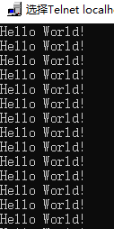
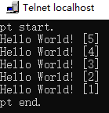
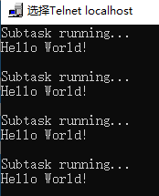
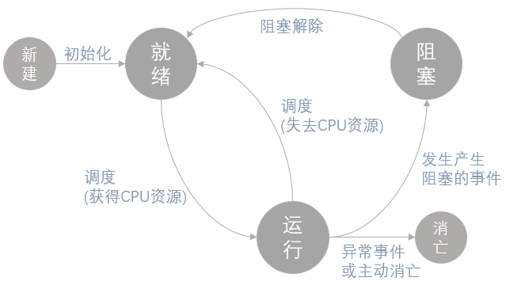
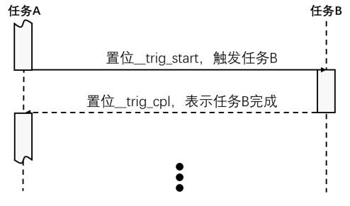
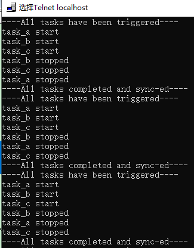

#  《VSF快速入门指南——使用Pt模式》  

##  1 本文目的及简介  
###  1.1 在什么情况下需要使用Pt模式  

&emsp;&emsp;VSF在综合考虑了用户的开发习惯、开发难度以及系统的资源开销以后，提供了多种适应不同系统环境的任务形式，例如，RTOS式的Thread模式，使用协作式调度的ProtoThread模式，裸机式的Task模式以及专为状态机设计的特殊脚本语言simple_fsm。ProtoThread模式使用的是共享堆栈，较Thread模式减少了资源(主要是RAM资源)消耗，而且ProtoThread模式更适合使用在顺序逻辑的场合。因此，**当系统的资源(尤其是RAM资源)较为紧张，并且多数任务的逻辑为顺序逻辑时，我们推荐用户使用协作式调度的ProtoThread模式。**  

###  1.2 如何快速的使用Pt模式进行开发  

&emsp;&emsp;本文将从VSF系统配置开始介绍，以"Hello World"为例带为您介绍如何创建并启动一个Pt线程任务。随后我们将分析Pt任务的适用场景、优点；拆解Pt任务的编写过程；解释VSF的调度策略和多任务间的通信协作方式——通过这一系列的讲解，力争使您快速掌握Pt模式的使用、完成VSF入门。

>**阅读本文档您将可以找到以下问题的答案：**
>>- 如何配置VSF使之支持Pt
>>- 如何简单快速的定义、编写、启动Pt任务
>>- 如何在Pt任务内延时
>>- 如何在Pt任务中与其他任务协作
>>- 如何在一个Pt任务中触发(启动)另外一个任务
>>- 如何在一个Pt任务中等待另外一个或多个任务完成
>>- VSF的基本调度策略是怎样的

###  1.3 ProtoThreads与VSF系统中的ProtoThread模式  

&emsp;&emsp;[ProtoThreads](http://dunkels.com/adam/pt/)是[Adam Dunkels](http://dunkels.com/adam/)为资源较为受限的小型系统(例如小型嵌入式系统或无线传感器网络节点)设计的轻量级无堆栈线程。但是ProtoThreads在资源消耗的控制上也有不尽人意的地方：  

>- ProtoThreads在调用子任务时消耗的栈是随着调用深度增加而增加的。
>- ProtoThreads在执行子任务时总是从顶层任务进入一层层向下到达目标子任务的，如果调用深度较大的话，进入和退出子任务无疑会消耗很多无谓的时间，浪费CPU资源。

&emsp;&emsp;VSF中的ProtoThread模式在保留了ProtoThreads优点(开发较为简单、体积小)的基础上克服了以上缺点：

>- 执行子Pt任务时不需要从顶层Pt任务一层层深入，而是直接进入；退出子PT任务时也不需要一层层推出，而是直接退出当前子PT任务——节省了大量的CPU时间。
>- 由于调用子PT时直接进入或退出目标子PT任务，因此对共享栈的消耗并不会随着子PT调用深度的增加而增加——始终由当前子PT任务的栈使用情况所决定。

###  1.4 关于阅读本文的一些约定  
####  1.4.1 在开始阅读之前  

&emsp;&emsp;我们假设您已经完成了VSF在目标平台上的部署。如果还没有完成这一步骤，您既可以参考VSF提供的相关图文教程完成移植和部署，也可以跳过这一步骤——直接使用Visual Studio的PC例程以软件模拟的方式体验VSF的开发；或是使用MDK自带的Fast Model对Cortex-M进行仿真。  

>在使用Fast Model时需要windows系统开启对telnet的支持。具体方法请阅读使用Fast Model进行仿真的相关文档，这里不做赘述。

####  1.4.2 阅读本文用户需要掌握的基本知识  

&emsp;&emsp;本文档所介绍的内容皆是基于常见的嵌入式C语言环境进行编写的，我们需要用户有一定的C语言基础知识并熟悉嵌入式开发环境的使用。  

>VSF支持MDK、IAR，Eclipse+GCC等常见开发环境，用户熟悉其中之一即可。

####  1.4.3 本文中涉及的部分关键名词解释  

|           名词           | 解释和约定                                                   | 备注                                                         |
| :----------------------: | :----------------------------------------------------------- | :----------------------------------------------------------- |
|            Pt            | VSF系统中的ProtoThread模式                                   |                                                              |
|           任务           | 在本文中如无特殊规定，“任务”均指无堆栈线程（ProtoThread）。  |                                                              |
|     实例（instance）     | VSF是一个完全使用面向对象概念实现的RTOS。每一个任务都是以类的形式进行定义的。定义用户任务的线程类在运行时刻都需要有一个实例（instance）。一个类可以有多个实例，同一个用户任务类也可以有多个不同的实例 | VSF使用C语言进行面向对象开发                                 |
|   单实例/静态实例任务    | 在VSF中，单实例和静态实例均表示“不可重入”的任务实例——即任意时刻，要保证任务的逻辑正确，都不允许同时存在多个任务实例。一般来说，在任务函数中使用了静态变量、寄存器而没有使用临界区进行保护的线程都是不可重入的，都只允许存在一个实例。这样的任务被称为“单实例”任务。这样的实例被称为单实例或者静态实例。<br/>特别需要强调的是：静态实例一定是用static进行修饰的；但用static修饰的实例不一定是静态实例。 | 是否使用static来创建任务实例不是判断一个实例是否是单实例的标准。 |
|        多实例任务        | 在VSF中，如果一个任务的实现是可重入的，则该任务类允许存在多个实例。对于多实例任务来说，用户如何进行实例变量的内存分配与该任务是否多实例的无关。也就是说，你既可以用static的方法来为多实例任务类分配空间，也可以用堆或者池的方式来实现动态分配。 | 多实例强调的是可重入，而无需真的有多个实例                   |
|          可重入          | 一般来说，如果一个函数可以被不同的任务实例同时多次使用，我们就说这个函数是可重复进入的（简称可重入）。实现可重入的关键是多个任务之间不能存在资源上的冲突。因此，如果某个函数内使用了静态分配的变量（比如全局变量或者静态局部变量），并且多个任务对这个静态分配的变量存在“改写”操作，则这里的“改写”可能会带来冲突，造成任务不可重入。 | 有mutex或者临界区保护的静态变量访问不会导致任务不可重入      |
| 阻塞代码（Blocking-Code) | 长时间占用CPU导致其它同优先级任务无法得到执行的代码称之为阻塞代码。根据阻塞代码在占用CPU时所作事情的不同又分为“轮询阻塞”和“算法阻塞“。<br/>\- 所谓轮询阻塞就是重复查询和等待某一状态变化的阻塞代码，比如，通过while循环等待外设的Flag置位（或者清零）。<br/>\- 所谓算法阻塞是指某一算法因为正常计算功能较为耗时而长时间占用CPU的行为。<br/>一般来说，我们要尽可能避免”轮询阻塞“，并根据实际情况适当在算法阻塞中插入”禅让点“，让CPU暂时”禅让“给其它”同优先级“的任务 | 参见5.1节                                                    |

##  2 如何使用Pt实现"Hello World!"  
###  2.1 如何配置VSF系统，使之支持Pt模式  

&emsp;&emsp;首先，用户文件内需包含 头文件vsf.h，然后 ***vsf\_usr\_cfg.h*** 内的相关配置如下：  

>如果用户要使用使用printf，则必须包含系统头文件 ***stdio.h***。

```
/*ENABLED:VSF支持任务间同步通信(IPC)*/
#define VSF_KERNEL_CFG_SUPPORT_SYNC             ENABLED  
    
/*ENABLED:支持Pt调用其他任务*/
#define VSF_KERNEL_CFG_EDA_SUPPORT_SUB_CALL     ENABLED

/*ENABLED:启用VSF对Pt模式的支持(必须打开)*/
#define VSF_KERNEL_CFG_EDA_SUPPORT_PT           ENABLED

/*VSF_OS_CFG_MAIN_MODE_EDA:将main函数初始化支持Pt实例*/
#define VSF_OS_CFG_MAIN_MODE                    VSF_OS_CFG_MAIN_MODE_EDA
```

###  2.2 使用main实例实现"Hello World!"  

&emsp;&emsp;完成上述 ***vsf\_usr\_cfg.h*** 的配置后，main函数将被初始化为一个Pt实例。在这一基础上，我们可以很容易地实现一个周期性打印“Hello World”的功能。所需步骤如下：  

**1) 包含必须的头文件**  

```
#include "vsf.h"
#include <stdio.h>
```

**2) 实现main实例**  

```
void main(void)
{
    static_task_instance(  
        /*描述当前任务使用了哪些系统服务*/
        features_used(
            mem_sharable   (/*把不会同时使用的系统服务放在这里（分时复用同一块内存用以节省空间）*/)
            mem_nonsharable(/*把可能会同时使用的系统服务放在这里*/) 
        )                    
    ) 

    vsf_pt_begin();

    vsf_stdio_init();

    while(1) {
        printf("Hello World!\r\n");
        vsf_pt_wait_until(vsf_delay_ms(1000));
    }

    vsf_pt_end();
}
```

>- 当main函数配置为Pt实例的时候，main函数返回类型必须为 ***void*** 。
>-  **系统服务：** 指执行指定系统功能的程序、例程或进程，以便支持其他程序，尤其是底层(接近硬件)程序。如何使用系统服务将在《IPC——多任务如何进行触发与同步》文档中介绍。
>- 通常来说由于main线程都是不可重入的（也不需要重入）因而算作静态实例。对静态实例的任务来说，如果使用了某些VSF提供的系统服务（并且该系统服务明确说明“需要用户在任务类中添加对应的feature声明”）， 则我们应该将feature列表 ***features\_used*** 嵌套在 ***static\_task\_instance*** 结构内。其它情况将在后续章节进行说明。
>- 在“Hello World”例子中，我们并没有使用任何这类”需要添加feature声明“的系统服务，因而只要保留对应的语法结构即可。

运行结果:  

>演示工程为FVP工程。



##  3 为什么要使用Pt模式进行开发  
###  3.1 Pt线程开发简单方便  

&emsp;&emsp;Pt任务的开发方式比较贴近裸机（每个任务都可以像main函数那样使用超级循环），并且允许使用阻塞性的代码（blocking-code）——这对习惯裸机开发方式的用户来说是十分友好的。

###  3.2 Pt线程占用的资源相对较少  

&emsp;&emsp;Pt任务与Thread任务的开发方式类似，但是Pt任务不具有自己的独立任务栈，这也就是说Pt任务不能保存自己的任务上下文到任务栈内——当调度器重新唤醒这个Pt任务时，它只能从头开始执行内部的逻辑。不过这样的设计带来的好处是对硬件资源(主要是RAM)的要求较Thread模式降低了很多，同时，用户使用Pt任务进行开发的时候不再需要像Thread模式那样在对某个任务需要分配多大的任务栈的问题上花费太多时间。  

>- 独立任务栈在给Thread模式带来便利的同时，也带来了较大的内存（RAM）开销。对资源较小的MCU来说，Thread带来的便利就成为“不可承受之轻”。
>- 用户在定义Thread任务类的时候需要指定任务栈的大小，而如何确定任务栈的大小却不是一件简单的事情。实践中，大部分用户出于提高开发速度的目的，往往会直接指定一个相对较大的经验值(比如1K)，并“假设”此时任务栈的大小是足够的——这种任性的“土豪”行为当然会导致相当数量的RAM资源处于闲置状态，造成浪费。

###  3.3 Pt模式与Thread模式的异同点  

|              相同点               |            不同点            |
| :-------------------------------: | :--------------------------: |
|     开发方式都和裸机比较贴近      |  Pt任务不具有独立的任务堆栈  |
| 都可以在任务内使用超级循环(while) | Pt任务的开始和结束对应vsf_pt_begin()和vsf_pt_end() |
|    都可以在任务内使用阻塞代码     | Pt任务使用IPC阻塞当前任务时，需要借助 vsf_pt_wait_until |
| 都可以将main函数初始化为模式对应的实例 | Pt任务自我"消亡"的时候只能使用break |

##  4 如何使用Pt进行开发  
###  4.1 如何配置VSF  

>支持Pt任务运行的最小配置。

**1) 开启VSF系统对任务间通信(IPC)的支持**  

    VSF_KERNEL_CFG_SUPPORT_SYNC             ENABLED

**2) 开启对Pt调用其他任务的支持**  

    VSF_KERNEL_CFG_EDA_SUPPORT_SUB_CALL     ENABLED

**3) 开启VSF对Pt模式的支持(必须打开)**  

    VSF_KERNEL_CFG_EDA_SUPPORT_PT           ENABLED

**4) 将main函数初始化支持Pt实例**
    VSF_OS_CFG_MAIN_MODE                    VSF_OS_CFG_MAIN_MODE_EDA

>如果需要不同优先级的Pt任务或者支持子任务的调用，还需要使能以下配置。

**1) 开启VSF系统对高优先级任务抢占低优先级任务的支持**  

    VSF_KERNEL_CFG_SUPPORT_PREMPT           ENABLED

**2) 开启VSF系统对优先级反转的支持**  

    VSF_KERNEL_CFG_SUPPORT_DYNAMIC_PRIOTIRY ENABLED

>支持优先级反转。

###  4.2 如何编写Pt任务  
####  4.2.1 如何定义自己的Pt类
**1) 如何声明Pt类**  

&emsp;&emsp;在定义自己的Pt类之前，我们需要对目标Pt类进行一个前置声明。这一前置声明可以放置在头文件（* .h）或者源文件（* .c）中，语法如下：  

    declare_vsf_pt(<目标Pt类的名称>)

&emsp;&emsp; ***<目标Pt类的名称>*** 顾名思义，是用户给目标pt类所起的名称。当我们完成pt类的定义后，我们可以直接使用这一名称作为C语言的自定义类型来使用，比如定义变量或者指针。  

&emsp;&emsp;假设我们需要一个叫做 ***user\_pt\_a\_t*** 的Pt类，声明如下：  

    declare_vsf_pt(user_pt_a_t)

>前置声明并**不包含完整**的类型信息（比如目标类型的大小信息、成员变量等等），因此在没有定义（描述）类的情况下，我们无法仅通过前置声明就进行”需要完整类型定义（描述）“的各类操作，比如：定义变量、使用sizeof计算类型大小、使用__alignof__获取类型的对齐、描述其它结构体的成员类型等等。

**2) 如何定义(描述)Pt类**  

&emsp;&emsp;在完成Pt类的前置声明之后，我们需要对这个Pt类的内容进行定义（描述）。Pt类的定义（描述）可以放置在头文件（* .h）或者源文件（* .c）中，语法如下：  

```
def_vsf_pt(<目标Pt类的名称>
    /* 配置当前任务使用了哪些系统服务 */
    features_used(          
        mem_sharable   (/*把不会同时使用的系统服务放在这里（分时复用同一块内存用以节省空间）*/)     
        mem_nonsharable(/*把可能会同时使用的系统服务放在这里*/)   
    )                    
    
    /* 定义成员变量 */
    def_params(             
        <成员变量列表>
    )
) 
```

&emsp;&emsp; ***<目标Pt类的名称>*** 是已经完成前置声明的Pt类。  
&emsp;&emsp; ***<成员变量列表>*** 用于列举任务函数中所有需要访问的用户变量，用户在任务函数中可以通过 ***ptThis->xxxxx*** 的方式直接访问。  

>有时候为了方便，我们会在对应的源代码内（.c文件中）定义一个宏：
>
>#undef this
>#define this (*ptThis)
>
>从而可以在代码中直接使用 ***this.xxxx*** 的方式（更为优雅地）访问任务的成员变量。

&emsp;&emsp;假设我们需要对Pt类 ***user\_pt\_a\_t*** 进行定义(描述)：成员变量是一个 ***uint32\_t*** 类型的计数器，内容如下：  

```
def_vsf_pt(user_pt_a_t

    features_used(
        mem_sharable( )
        mem_nonsharable( )
    )
    
    def_params(
        uint32_t cnt;
    )
)
```

**3) 如何通过Pt类创建一个实例**  

&emsp;&emsp;当我们完成了对Pt类的定义（描述）后，就可以直接使用Pt类的名称作为C语言的自定义类型创建实例（定义变量）。注意，一般来说创建实例的操作必须要放置在源文件（* .c）中。最简单的情况下，我们可以使用**static**创建类的实例，语法如下：  

    static <Pt类的名称> <实例名称>;

&emsp;&emsp; ***<Pt类的名称>*** 是已经完成类定义（描述）的Pt类名称。  
&emsp;&emsp; ***<实例名称>*** 是我们给Pt类实例起的名字。  

>在原生的面向对象语言中，创建类的实例通常自动隐含了"构造（construction）"的过程。在我们通过C语言模拟的面向对象开发中，创建实例仅仅指为目标类分配存储器空间，类的初始化（或者说"构造"）需要用户自行处理

假设我们希望用**static**为 ***user\_pt\_a\_t*** 创建一个实例、叫做 ***\_\_user\_task\_a***，表达式如下：  

    static NO_INIT user_pt_a_t __user_task_a;

>在VSF环境下，由NO_INIT修饰的变量，不仅不能携带初始值，编译器也将不会对其进行清零操作。这样可以避免芯片启动时对不需要默认初始化的变量进行清零操作（编译器一般会在初始化的过程中对ZI段内的变量进行默认清零操作），从而加快芯片启动速度。

**4) 如何通过Pt类创建多个实例**  

&emsp;&emsp;在VSF系统内可以通过堆分配（Heap）或者池分配（Pool）的方式为Pt类动态创建多个实例，具体操作方法请阅读VSF关于动态内存分配的相关文档，这里将不再赘述。

####  4.2.2 如何编写Pt任务函数  

&emsp;&emsp;Pt任务函数应当编写在源文件内（* .c），语法如下：  

```
implement_vsf_pt(<已定义的Pt类型名称>) 
{
    vsf_pt_begin();
    
    while(1) {
        <用户代码>
    }
    
    vsf_pt_end();
}
```

>Pt任务的用户代码的写法与main函数类似，通常都包含一个超级循环。当用户跳出了超级循环，或者执行了”break;“都将导致当前Pt任务实例的”自我消亡“。

&emsp;&emsp;假设我们希望在 ***user\_pt\_a\_t*** 任务函数内周期性的打印"Hello World!"，内容如下：  

```
implement_vsf_pt(user_pt_a_t) 
{
    vsf_pt_begin();
    
    printf("pt start.\r\n");
    while(1) {
        if (0 == this.cnt) {
            break;
        }
        printf("Hello World! [%d]\r\n", this.cnt--);  /*打印字符串*/
        vsf_pt_wait_until(vsf_delay_ms(1000));        /*延时一秒*/
    }
    printf("pt end.\r\n");    

    vsf_pt_end();
}
```

####  4.2.3 如何构造(construct)并启动一个Pt实例  

&emsp;&emsp;在启动Pt任务实例之前需要首先完成对实例构造（construction），具体的来说，就是对实例中类的成员变量进行必要的初始化。一个典型的语法结构如下：  

```
<Pt类的实例>.param.<成员变量> = <初始值>;
...
init_vsf_pt(<Pt类的名称>, <Pt类实例的地址>, <任务优先级>);
```

&emsp;&emsp; ***<任务优先级>*** 是对所启动的任务指定一个任务优先级，这个优先级是VSF系统任务调度的依据。  

>- 用户在移植VSF系统时可以在 ***vsf\_usr\_cfg.h*** 头文件内通过宏 ***VSF\_OS\_CFG\_PRIORITY\_NUM*** 来配置用户实际要用的优先级数量。如果用户未定义此宏，则VSF系统会使用当前硬件所支持的最大可用任务优先级数来默认定义这个宏（需要注意的是：可用优先级数量由具体硬件决定，并不由硬件中断优先级个数决定）。
>- VSF系统中用户可以使用的最低和最高优先级分别是 ***vsf\_prio\_0*** 和 ***vsf\_prio\_highest*** ，数值越高，优先级越高。

&emsp;&emsp;在上面的介绍中我们定义了一个Pt类 ***user\_pt\_a\_t*** 并创建了一个此类型的实例 ***\_\_user\_task\_a***，下面的代码演示了如何初始化实例 ***\_\_user\_pt\_a*** 的成员变量并启动该实例:  

```
__user_pt_a.param.cnt = 5;  //!< 延时5秒;
init_vsf_pt(user_pt_a_t, &__user_task_a, vsf_prio_0);
```

运行结果：  

>- 演示工程为FVP工程。
>- 成员变量cnt的值初始化为5，即任务会在运行五个周期后结束。  



###  4.3 Pt任务如何调用Pt任务  

**1) Pt子任务类型的定义**  

&emsp;&emsp;如何定义(描述)一个Pt任务类型上文已经详细介绍，这里不再赘述，只给出实现：  

```
/*前置声明*/
declare_vsf_pt(user_pt_a_t)

/*定义Pt任务类型*/
def_vsf_pt(user_pt_a_t,
    features_used(
        mem_sharable( )
        mem_nonsharable( )
    )

    def_params(
    )
);
```
**2) Pt子任务的定义**  

&emsp;&emsp;如果我们希望通过任务B调用Pt子任务(任务A)，则需要在任务B内定义一个基于任务A类型的"子任务"，相关语法如下：  

    vsf_pt(<子任务的任务类型>) <"子任务"名称>;

&emsp;&emsp; ***<子任务的任务类型>*** 是需要调用的子任务的任务类型。  
&emsp;&emsp; ***<"子任务"名称>*** 是符合C语言标准的合法名称。  

&emsp;&emsp;如果我们希望在 **初始化为Pt任务实例的main函数** 中调用 ***user\_pt\_a\_t*** 类型的任务，则需要在实现main函数的时候在其 ***def\_params*** 内如下操作：  

```
def_params(
    vsf_pt(user_pt_a_t) sub_pt;
)
```
**3) 实现Pt子任务的用户逻辑**  

&emsp;&emsp;如果我们希望子任务被调用一次只运行一次，则应当如下编写：  

```
implement_vsf_pt(user_pt_a_t) 
{
    vsf_pt_begin();
    
    while(1) {
        /*打印log*/
        printf("Subtask running...\r\n");
        printf("Hello World!\r\n\r\n");

        /*退出while(1)*/
        break;
    }
    
    vsf_pt_end();
}
```

>- Pt任务被调用( ***vsf\_pt\_call\_pt*** )之后会不停的运行，直到自我"消亡"才会停止，所以如果我们希望子任务被调用后只运行一次，就需要在执行完任务后让子任务自我"消亡"。  
>- Pt任务自我"消亡"必须通过 ***vsf\_pt\_end()*** ，因此结束Pt任务使用 ***break;*** ，而不能使用 ***return;*** 。

**4) 实现main函数逻辑并调用子任务**  

&emsp;&emsp;如果我们希望在main函数内每间隔一秒调用一次子任务，则应当如下实现：  

```
void main(void)
{
    static_task_instance(  
        features_used(
            mem_sharable   ( )
            mem_nonsharable( ) 
        )                    
        def_params(
            /*定义基于任务类型user_pt_a_t的"子任务"*/
            vsf_pt(user_pt_a_t) sub_pt;
        )
    )     

    vsf_pt_begin();

    /* 初始化stdio服务 */
    vsf_stdio_init();

    while(1) {
        /*调用Pt子任务*/
        vsf_pt_call_pt(user_pt_a_t, &this.sub_pt);

        /*延时一秒*/
        vsf_pt_wait_until(vsf_delay_ms(1000));
    }
    vsf_pt_end();
}
```

运行结果：  

>演示工程为FVP工程。



###  4.4 Pt任务如何调用Thread任务  

&emsp;&emsp;在4.3章节我们介绍了如何使用main函数作为母函数去调用Pt子任务，下面我们将以调用Thread子任务为例介绍如何在独立Pt任务内调用子任务。  

>- 无论是在被初始化为Pt实例的main函数内调用子任务，还是在独立Pt实例内调用子任务，方法与原理并无不同，这里我们只为了做不同形式的展示。
>- 调用Pt子任务与调用Thread子任务的方法与原理是一致的，只是使用的接口略有不同。

**1) 定义Pt及Thread类型**  

```
/*前置声明*/
declare_vsf_thread(user_thread_a_t)

/*定义类型*/
/*参数：类型名称、任务栈大小*/
def_vsf_thread(user_thread_a_t, 1024,
    features_used(
        mem_sharable( )
        mem_nonsharable( )
    )

    def_params(
    )
);

declare_vsf_pt(user_pt_b_t)

def_vsf_pt(user_pt_b_t,
    features_used(
        mem_sharable( )
        mem_nonsharable( )
    )

    def_params(
        /*定义基于任务A类型的"子任务"*/
        vsf_thread(user_thread_a_t) sub_thread;
    )
);
```

>- **注意：**这里定义Thread"子任务"使用的接口是 ***vsf\_thread*** 。
>- 读者在**使用VSF的Thread模式之前**，需要配置VSF以获得相应支持。相关操作请读者参考文档《VSF快速入门指南——使用Thread模式》，这里不做赘述。

**2) 实现Pt任务及Thread任务的用户逻辑**  

&emsp;&emsp;在本示例中我们依然希望任务B每间隔一秒钟调用子任务(任务A)一次，而子任务被调用一次运行一次，代码如下：

```
implement_vsf_thread(user_thread_a_t) 
{    
    while(1) {
        /*打印log*/
        printf("Subtask running...\r\n");
        printf("Hello World!\r\n\r\n");

        /*退出while(1)*/
        break;
    }
}

implement_vsf_pt(user_pt_b_t) 
{
    vsf_pt_begin();
    
    while(1) {
        /*调用子Thread任务*/
        vsf_pt_call_thread(user_thread_a_t, &this.sub_thread);

        /*延时一秒*/
        vsf_pt_wait_until(vsf_delay_ms(1000));
    }
    
    vsf_pt_end();
}
```

>- **注意：**这里调用Thread子任务使用的接口是 ***vsf\_pt\_call\_thread*** 。
>- Thread线程退出任务无论使用"break;"或者"return;"，效果相同的，这里示例使用"break;"。

**3) 创建任务启动函数并启动Pt任务**  

&emsp;&emsp;这里的操作与上4.3章节的示例没有差别。  

```
void vsf_kernel_pt_call_thread_simple_demo(void)
{    
    static NO_INIT user_pt_b_t __user_task_b;
    init_vsf_pt(user_pt_b_t, &__user_task_b, vsf_prio_0);
}

int main(void)
{
    ...

    /* 初始化stdio服务 */
    vsf_stdio_init();
    
    /*启动任务*/
    vsf_kernel_pt_call_thread_simple_demo();

    while(1) {
        /*延时一秒*/
        vsf_delay_ms(1000);
    }
}
```
>- 这里的main函数没有初始化为Pt的实例。
>- 运行结果与4.3章节的示例没有差别，这里不再重复放图。  

###  4.5 各种情况下Pt调用子任务(或子函数)时行为的比较  

|                           |                ProtoThreads                |            VSF中的Pt调用子函数             |               VSF中的Pt调用Pt子任务                |                  VSF中的Pt调用Thread子任务                   |
| :-----------------------: | :----------------------------------------: | :----------------------------------------: | :------------------------------------------------: | :----------------------------------------------------------: |
|          栈消耗           |  随着调用深度的增加，栈的消耗也在不断增多  |  随着调用深度的增加，栈的消耗也在不断增多  | 无论调用多少层，使用的栈都只取决于当前运行的Pt任务 | 进入Thread子任务后就会切换到Thread线程的软件栈，因此并不会影响Pt任务所使用的栈 |
|      传递参数的方法       | 直接通过传递参数给被调用函数的方法进行传递 | 直接通过传递参数给被调用函数的方法进行传递 |              通过给Pt任务的控制块赋值              |                    通过给Thread控制块赋值                    |
|   是否可以继续调用子Pt    |                     是                     |                     否                     |                         是                         |                              是                              |
| 是否可以使用pt_wait_until |                     是                     |                     否                     |                         是                         |                         直接使用IPC                          |

##  5 Pt任务之间是如何进行通信与同步的  

>本文档仅针对常见的应用场景提供简单的演示，关于VSF中任务间通信和同步的详细讲解，请参考文档《IPC——多任务如何进行触发和同步》。  

###  5.1 Pt的调度策略  

&emsp;&emsp;VSF为所有的任务（包括但不限于Pt）提供了统一的优先级调度策略。每个任务在创建时都必须指定一个优先级，这一优先级在任务启动后将不再允许用户手工修改。VSF支持优先级反转，这为不同优先级的任务使用同一个互斥量或者临界区提供了可能。  
&emsp;&emsp;同时这里需要指出任务的三种状态以便读者更好的理解VSF的Pt调度策略：  

- 运行：任务已经分配到执行时所需要的各种资源，包括CPU，这个时候任务是正在执行的。  
- 就绪：任务已经分配到除去CPU之外的执行时所需要的各种资源，这个时候任务处在获得CPU使用权就可以进行执行的状态。  
- 阻塞：正在运行的任务由于某个事件而无法继续执行并让出CPU的状态，称为阻塞状态，亦称为暂停状态。  

任务状态转换示意图：  



**1) 不同优先级下的调度策略**  

&emsp;&emsp;在任务调度未被屏蔽的情况下，当高优先级任务就绪时，可以立即打断正在执行的低优先级任务。VSF的调度器永远只执行就绪任务中（Ready）优先级最高的那个任务。这一点非常重要。我们在后面介绍禅让的概念时还会再次提到。

**2) 同优先级下的调度策略**  

&emsp;&emsp;VSF允许多个任务拥有相同的优先级。与不同优先级任务之间使用的“抢占式调度（preemptive）”策略不同，相同优先级的任务之间采用“合作式调度（cooperative）“策略进行协作。简单来说，同优先级的任务之间是彼此不能打断的，他们相互具有原子性。当且仅当一个任务根据情况决定需要暂时让出CPU给其它同优先级的任务使用时，它可以使用VSF专门提供的”禅让“接口来实现这一功能。  

>与其他RTOS系统一样，VSF系统内的延时接口也具有暂时让出CPU的效果。

**3) 禅让(vsf\_yield)**  

&emsp;&emsp;在VSF中用户可以通过调用API函数 ***vsf\_yield()*** 来暂时将CPU出让给同优先级的其它任务。值得特别强调的是，对当前任务来说，禅让虽然暂时放弃了CPU的控制权，但当前任务仍然处于"就绪状态（Ready）"而非“阻塞（Blocked）”状态。这就意味着，一个任务并 不能 通过禅让的方式给低优先级任务创造出任何执行的机会。例如，一种可能的情况是：假设当前正在执行的任务决定要禅让，此时没有其它同优先级的任务就绪，那么CPU实际上只是相当于出去转了一圈，看看有没有同优先级的"同党"——一看空无一人，就又把控制权交还给了之前主动“禅让”的任务。  

>无论如何“禅让”，CPU始终都在同一个优先级的小圈子里轮转，低优先级的任务是始终没有机会的。实际上，拥有相同优先级的所有任务中，哪怕只有一个任务（在某一段时间内）使用了“禅让”，那么在它进行“禅让”的这一其间，低优先级任务是没有任何机会的。

&emsp;&emsp;正因为禅让具有这种“只顾小圈子利益”的特性，一般来说，我们应该非常谨慎的使用这一特性。简单来说，在存在以下情况的场合中我们应该（尽可能）避免使用这一功能：  

- 有低功耗要求的场合
- 在高优先级的任务中
- 在可以通过普通IPC方式实现相同功能的情况下
- 在明确可以通过delay让当前任务休眠一段时间的情况下

&emsp;&emsp;需要**声明**的是：在Pt任务中，使用任何带有"阻塞"性质的接口都需要配合 ***vsf\_pt\_wait\_until*** 接口使用，包括**禅让**接口。使用方式示例：  

```
vsf_pt_wait_until(vsf_delay_ms(1000));
vsf_pt_wait_until(vsf_trig_wait(&__task_cpl));
vsf_pt_wait_until(vsf_yield());
```

**4) 总结**  

|   优先级   | 是否抢占 | 调度策略                                                     |
| :--------: | :------: | ------------------------------------------------------------ |
| 不同优先级 |    是    | 高优先级就绪任务会抢占低优先级任务                           |
| 相同优先级 |    否    | 相同优先级的任务之间彼此不能抢占，没有时间片轮转机制。允许用户通过“禅让”机制实现同优先级任务之间用户自定义规则的合作式调度。 |

###  5.2 如何在Pt任务内实现延时  

&emsp;&emsp;VSF系统除了与普通RTOS一样提供了以系统时钟节拍（System Timer Tick）为基本单位的延时接口 ***vsf\_delay()*** 外，更提供了以绝对物理时间为单位的版本，比如使用毫秒（ms）的 ***vsf\_delay\_ms()*** 和使用微秒（us）的 ***vsf\_delay\_us()*** ，这种设计极大的降低了用户任务与硬件系统实际使用频率之间的耦合度。在使用这些API函数时，有三点需要强调：

- 根据当前arch中timer服务的实现方式（Model）、时钟频率（Systimer Frequency）、以及精度（Systimer Resolution）的不同，在延时时间较小的情况下，VSF不一定能提供用户所指定的延时时间。比如当系统频率是1MHz时，***vsf\_delay\_us(1)*** 实际上是无法做到的，此时，***vsf\_delay\_us(1)*** 等效于暂时阻塞当前任务，并将当前任务重新加入到当前优先级就绪队列的尾部。
- arch中的timer一般使用tickless的计时模型。在这种情况下，VSF的始终服务并不会为每一个Tick都产生对应的中断处理请求，而仅在必要的情况下产生最少的中断。在精度和频率允许的情况下，VSF可以提供较为精确的微秒级延时。这里，精度永远小于等于系统时钟频率所规定的上限：例如，100KHz的输入频率是不可能支持1us的延时精度的。当用户使用 ***vsf\_delay\_us()*** 所指定的精度无法达到时，VSF会提供一个最近似的延时效果。
- 由于高优先级任务的存在，VSF所提供的实际延时效果可能会存在误差。提高输入系统时钟的频率可以缓解这一问题但无法从理论上杜绝——这是RTOS调度开销所决定的。

###  5.3 如何构建临界区  
**1) 什么是临界区**  

&emsp;&emsp;**临界资源**：多个任务使用互斥（mutually exclusive）的方式进行访问的共享资源称作临界资源。  

&emsp;&emsp;**临界区**：任意时刻仅能有一个任务访问的区域叫做临界区。如果所有相关的任务均“彼此排他”地进入临界区、访问临界资源，便可以保证每个任务对临界资源的访问都是正确且可靠的。为了方便用户简单快捷的构建临界区，VSF提供了一个专门的类 ***vsf\_crit\_t*** 来协调多任务对临界区的访问：  

&emsp;&emsp;1.当一个任务尝试进入临界区时应该调用专门的API函数 ***vsf\_crit\_enter()*** 对临界区的状态进行检查——如临界区未被其它任务占用，则当前任务进入临界区并从函数 ***vsf\_crit\_enter()*** 返回用户任务；如此刻临界区正被其它任务访问，则 阻塞 当前任务直到临界区被其它线程释放——进入临界区后从 ***vsf\_crit\_enter()*** 中返回用户任务。  
&emsp;&emsp;2.当一个任务完成了对临界资源的访问后，应该立即调用 ***vsf\_crit\_leave()*** 函数从临界区中推出，从而释放资源，允许其它任务对临界区进行访问。  

&emsp;&emsp;下面我们将手把手的教您如何在VSF系统中定义和使用临界区（ ***vsf\_crt\_t*** ）:   

**2) 定义一个临界区变量**  

&emsp;&emsp;如果我们希望定义一个临界区变量叫 ***\_\_crit\_a*** ，代码如下：  

    static NO_INIT vsf_crit_t __crit_a; 

>对于NO_INIT修饰的变量，编译器将不会再进行（默认）赋0的初始化操作。由于后面我们会通过专门的API函数 ***vsf\_crit\_init*** 完成对临界区变量的初始化，因而在定义时**推荐**使用NO_INIT来跳过对其的清零过程——加快软件系统的启动速度。

**3) 初始化临界区变量**  

&emsp;&emsp;在定义一个临界区变量之后我们需要对其进行初始化，语法如下：  

    vsf_crit_init(<临界区变量的地址>);

&emsp;&emsp;例如：  

    vsf_crit_init(&__crit_a);

**4) 构建临界区**  

&emsp;&emsp;临界区的规则由配对使用的API函数来实现：从**调用函数 *vsf\_crit\_enter()* 尝试进入**开始，到**调用函数 *vsf\_crit\_leave()* 离开临界区**结束。语法如下：  

```
vsf_crit_enter(<临界区变量的地址>);   /*尝试进入临界区*/

/*对临界资源的访问*/   

vsf_crit_leave(<临界区变量的地址>);   /*离开临界区*/
```

&emsp;&emsp;继续以 ***\_\_crit\_a*** 为例，代码如下：  

```
vsf_crit_enter(&__crit_a);  

/*对临界资源的访问*/

vsf_crit_leave(&__crit_a);
```

###  5.4 如何在Pt任务中触发另外一个任务  

&emsp;&emsp;VSF系统提供了专门的触发类（ ***vsf\_trig\_t*** ）在任务间**单向的传递触发信号**。 ***vsf\_trig\_t*** 类在使用时根据触发信号复位的方式不同分为自动复位（Auto Reset）和手动复位（Manual Reset）两种模式。为了方便大家的理解，下文将以常见的“异步任务范式”为例，为您介绍两种模式的具体使用方法。  

>异步任务范式描述的是这样一种使用情景：  
>- 为了实现某一个功能或服务，我们设计并实现了一个专门的任务。
>- 该任务在完成了初始化后，等待一个专门的触发信号来启动后续的任务。
>- 可选的，当对应功能或服务完成后，该任务会通过另外一个专门的触发信号将“任务已完成”的信息告知外界。
>- 在这个过程中，任务只专注于用于启动和报告完成的触发信号以及所要实现的功能和服务本身，而并不关心究竟是谁（哪个任务）发出了启动的触发信号，也不关心完成信号究竟被谁所接收。
>异步任务范式的最简单形式如下图所示：  
>任务A通过 ***\_\_task\_start*** 触发任务B后挂起等待完成信号 ***\_\_task\_cpl*** ，当任务B被触发且运行完成后置位 ***\_\_task\_cpl*** ，重新触发任务A继续运行。  

对应事件的触发图如下：  



**1) 定义相关的宏及vsf\_trig\_t实例**  

```
#define SET     true   /*置位*/
#define RESET   false  /*复位*/
#define AUTO    true   /*自动复位*/
#define MANUAL  false  /*手动复位*/

/*定义两个trig：__task_start、__task_cpl*/
static NO_INIT vsf_trig_t __task_start;     /* __task_start 用于启动任务B */
static NO_INIT vsf_trig_t __task_cpl;       /* __task_cpl 用于报告任务B完成 */
```

**2) 初始化vsf\_trig\_t变量**  

&emsp;&emsp;初始化 ***vsf\_trig\_t*** 的接口为 ***vsf\_trig\_init()*** ，语法如下：  

    vsf_trig_init(<vsf_trig_t变量的地址>, <初始状态>, <是否为自动复位>);

&emsp;&emsp; ***<初始状态>*** 的值为布尔量，表示初始化后 ***vsf\_trig\_t*** 的变量是否已经处于触发状态。  
&emsp;&emsp; ***<触发信号的复位方式>*** 为布尔量，表示对应的触发是否在被 ***vsf\_trig\_wait()*** 检测到后立即自动复位。  
&emsp;&emsp;假设我们要将 ***\_\_task\_start*** 、 ***\_\_task\_cpl*** 初始化为未触发（复位状态）、使用自动复位，代码如下:  

```
vsf_trig_init(&__task_start, RESET, AUTO);    
vsf_trig_init(&__task_cpl, RESET, AUTO);
```

**3) 如何发生(set)和等待(wait)一个触发信号**  

&emsp;&emsp;当我们需要发送一个出发时应当使用 ***vsf\_trig\_set()*** 接口，语法如下：  

    vsf_trig_set(<vsf_trig_t变量的地址>);

&emsp;&emsp;如果我们需要等待一个触发信号应当使用 ***vsf\_trig\_wait()*** 接口，语法如下：  

    vsf_trig_wait(<vsf_trig_t变量的地址>);

&emsp;&emsp;需要注意的是，在还未接收到触发信号的情况下，***vsf\_trig\_wait()*** 会阻塞当前任务的执行，直到信号被触发。当复位方式为自动复位时，***vsf\_trig\_wait()*** 会在接收到的触发信号的同时自动将状态复位。  

- 任务A的实现：  

```
implement_vsf_pt(user_pt_a_t) 
{
    vsf_pt_begin();

    while(1) {
        /*触发__task_start，启动任务B*/
        vsf_trig_set(&__task_start);   

        /*等待__task_cpl信号*/
        vsf_pt_wait_until(vsf_trig_wait(&__task_cpl));    

        ...  /*其它代码 */
    }

    vsf_pt_end();
}
```

- 任务B的实现：  

```
implement_vsf_pt(user_pt_b_t) 
{
    vsf_pt_begin();

    while(1) {
        /*等待启动信号*/
        vsf_pt_wait_until(vsf_trig_wait(&__task_start));  

        ...  /*做一些工作*/

        /*设置完成信号*/
        vsf_trig_set(&__task_cpl);     
    }

    vsf_pt_end();
}
```

**4) 手动复位触发状态**  

&emsp;&emsp;当 ***vsf\_trig\_t*** 变量被初始化为手动复位模式时，***vsf\_trig\_wait()*** 在检测到触发信号后，并不会替我们复位信号的状态。此时，当我们需要对 ***vsf\_trig\_t*** 的变量进行手动复位，应该使用函数 ***vsf\_trig\_reset()*** ，语法如下：  

    vsf_trig_reset(<vsf_trig_t变量的地址>);

&emsp;&emsp;同样以“异步任务范式”为例，如果 ***\_\_task\_start*** 复位方式为**手动复位**，则为了实现相同的执行效果，初始化代码修改如下：  

    vsf_trig_init(&__task_start, RESET, MANUAL);

- 任务B的实现修改如下：  

```
implement_vsf_pt(user_pt_b_t) 
{
    vsf_pt_begin();

    while(1) {
        /*等待启动信号*/
        vsf_pt_wait_until(vsf_trig_wait(&__task_start));  

        ...  /*做一些工作*/

        /*最后复位__task_start，以忽略这段时间内的启动请求*/
        vsf_trig_reset(&__task_start); 

        /*设置完成信号*/
        vsf_trig_set(&__task_cpl);   
    }

    vsf_pt_end();
}
```

###  5.5 如何在时间上同步多个Pt任务  

&emsp;&emsp;当存在多个任务同时运行的情况下，我们应该假设每个任务的执行时间都是不尽相同的——即便多个任务同时开始运行，它们的完成时间也是不同的。在一些应用场景下，某些任务必须要等待多个任务全都完成后才能开始运行（比如这个任务需要前面多个任务提供的全部信息），此时，我们需要引入某种多任务间的同步范式，以实现这样的功能，这里我们不妨简单的称之为“多任务同步范式”。  

>多任务同步范式描述的是这样一种情形：
>- 存在多个任务，他们的执行时间是任意的，他们的起始执行时间是任意的。
>- 由于功能上的需要，某些任务必须等待上述所有的这些任务全都完成后才可以开始执行。
>- 需要通过某种任务间的同步机制监测目标任务是否完成——当所有目标任务都完成时，产生一个信号，告知等待中的任务。
>为了演示方便，我们不妨引入一个用于协调的conductor任务、以及三个使用“异步任务范式”的服务任务A、B和C。假设应用场景为任务conductor启动任务A、B、C后打印触发完成信息，并等待来自任务A、B、C的完成信号；当任务A、B、C都运行完成后触发任务conductor打印多任务同步信息。  

对应事件触发图示如下：  


**1) 初始化所有的启动和完成信号**  

```
/*初始化__task_x_start初始状态为未触发、自动复位*/
vsf_trig_init(&__task_a_start, RESET, AUTO);  
vsf_trig_init(&__task_b_start, RESET, AUTO);
vsf_trig_init(&__task_c_start, RESET, AUTO);

/*初始化__task_x_cpl初始状态为未触发、手动复位*/
vsf_trig_init(&__task_a_cpl, RESET, MANUAL);  
vsf_trig_init(&__task_b_cpl, RESET, MANUAL);
vsf_trig_init(&__task_c_cpl, RESET, MANUAL);
```

**2) 任务A、B、C的实现例子**  

```
implement_vsf_pt(user_pt_a_t) 
{
    vsf_pt_begin();

    while(1) {
        /*等待任务启动信号*/
        vsf_pt_wait_until(vsf_trig_wait(&__task_a_start)); 
        printf("task_a start\r\n");    

        /*延时随机一段时间模拟不同的任务执行时间*/
        vsf_pt_wait_until(vsf_delay_ms(rand()));          
        printf("task_a stopped\r\n");

        /*发送任务完成信号*/
        vsf_trig_set(&__task_b_cpl);     
    }

    vsf_pt_end();
}

implement_vsf_pt(user_pt_b_t) 
{
    vsf_pt_begin();

    while(1) {
        /*等待任务启动信号*/
        vsf_pt_wait_until(vsf_trig_wait(&__task_b_start)); 
        printf("task_b start\r\n");    

        /*延时随机一段时间模拟不同的任务执行时间*/
        vsf_pt_wait_until(vsf_delay_ms(rand()));          
        printf("task_b stopped\r\n");  

        /*发送任务完成信号*/
        vsf_trig_set(&__task_b_cpl);   
    }

    vsf_pt_end();
}

implement_vsf_pt(user_pt_c_t) 
{
    vsf_pt_begin();

    while(1) {
        /*等待任务启动信号*/
        vsf_pt_wait_until(vsf_trig_wait(&__task_c_start)); 
        printf("task_c start\r\n");    

        /*延时随机一段时间模拟不同的任务执行时间*/
        vsf_pt_wait_until(vsf_delay_ms(rand()));          
        printf("task_c stopped\r\n");

        /*发送任务完成信号*/
        vsf_trig_set(&__task_b_cpl);   
    }

    vsf_pt_end();
}
```

>我们通过随机数发生器在任务A、B、C中各延时随机的一段时间，以模拟不同任务不同的执行时间。

**3) 任务conductor等待三个\_\_task\_x\_cpl全部被触发后才执行后续的工作**  

>这里我们使用初始化为Pt实例的main函数作为conductor任务。

```
void main(void) 
{
    static_task_instance(  
        features_used(
            mem_sharable   ( )
            mem_nonsharable( ) 
        )                    
    )

    vsf_pt_begin();

    vsf_stdio_init();

    ...

    while(1) {
        /*启动所有的异步任务*/
        vsf_trig_set(&__task_a_start);	
        vsf_trig_set(&__task_b_start);
        vsf_trig_set(&__task_c_start);

        printf("----All tasks have been triggered----\r\n");     

        /*等待全部完成信号*/
        vsf_pt_wait_until(vsf_trig_wait(&__task_a_cpl)); 	
        vsf_pt_wait_until(vsf_trig_wait(&__task_b_cpl));  
        vsf_pt_wait_until(vsf_trig_wait(&__task_c_cpl));  

        printf("----All tasks completed and sync-ed----\r\n");   

		/*复位所有的完成信号*/ 
        vsf_trig_reset(&__task_a_cpl);     
        vsf_trig_reset(&__task_b_cpl);
        vsf_trig_reset(&__task_c_cpl);
        
        /*后续其它工作*/
		...
    }

    vsf_pt_end();
}
```

>- main函数初始化为Pt实例后，函数返回值类型必须为 ***void*** 。
>- 关于触发器变量的初始化及任务启动函数的编写这里也不再赘述。

同步范式运行结果：  

>- 演示工程为FVP工程。
>- 可见由于A、B、C三个任务的执行周期不同，它们的任务执行结束的时间也不同，这导致打印的顺序存在不同。



##  附录

|    接口名称     |                           函数原型                           |   参数   |    参数类型     |        参数意义        |    参数取值范围     |             接口功能              |
| :-------------: | :----------------------------------------------------------: | :------: | :-------------: | :--------------------: | :-----------------: | :-------------------------------: |
|   init_vsf_pt   |    void init_vsf_pt(name, name  * ptask, vsf_prio_t pri)     |   name   | 合法的C语言名称 |     目标Pt类的名称     |          -          |            启动Pt实例             |
|                 |                                                              |  ptask   |     name *      |   目标Pt类实例的地址   |        非空         |                                   |
|                 |                                                              |   pri    |   vsf_prio_t    |       任务优先级       | 根据实际VSF配置决定 |                                   |
| init_vsf_thread |   void init_vsf_thread(name, name  * task, vsf_prio_t pri)   |   name   | 合法的C语言名称 |   目标Thread类的名称   |          -          |          启动Thread实例           |
|                 |                                                              |  ptask   |     name *      | 目标Thread类实例的地址 |        非空         |                                   |
|                 |                                                              |   pri    |   vsf_prio_t    |       任务优先级       | 根据实际VSF配置决定 |                                   |
| vsf_mutex_init  |          void vsf_mutex_init(vsf_mutex_t  * mutex)           |  mutex   |  vsf_mutex_t *  |      互斥量的地址      |        非空         |           初始化互斥量            |
| vsf_mutex_enter |          void vsf_mutex_enter(vsf_mutex_t  * mutex)          |  mutex   |  vsf_mutex_t *  |      互斥量的地址      |        非空         |            占用互斥量             |
| vsf_mutex_leave |          void vsf_mutex_leave(vsf_mutex_t  * mutex)          |  mutex   |  vsf_mutex_t *  |      互斥量的地址      |        非空         |            释放互斥量             |
|  vsf_crit_init  |             void vsf_crit_init(vsf_crit  * crit)             |   crit   |   vsf_crit *    |      临界区的地址      |        非空         |           初始化临界区            |
| vsf_crit_enter  |            void vsf_crit_enter(vsf_crit  * crit)             |   crit   |   vsf_crit *    |      临界区的地址      |        非空         |            进入临界区             |
| vsf_crit_leave  |            void vsf_crit_leave(vsf_crit  * crit)             |   crit   |   vsf_crit *    |      临界区的地址      |        非空         |            退出临界区             |
|  vsf_trig_init  | void vsf_trig_init(vsf_trig_t  * trig, bool set, bool auto _ rst) |   trig   |  vsf_trig_t *   |      触发器的地址      |        非空         |           初始化触发器            |
|                 |                                                              |   set    |      bool       |    触发器的初始状态    |     false/true      |                                   |
|                 |                                                              | auto_rst |      bool       |   触发器是否自动复位   |     false/true      |                                   |
|  vsf_trig_set   |            void vsf_trig_set(vsf_trig_t  * trig)             |   trig   |  vsf_trig_t *   |      触发器的地址      |        非空         |               触发                |
|  vsf_trig_wait  |            void vsf_trig_wait(vsf_trig_t  * trig)            |   trig   |  vsf_trig_t *   |      触发器的地址      |        非空         |             等待触发              |
| vsf_trig_reset  |           void vsf_trig_reset(vsf_trig_t  * trig)            |   trig   |  vsf_trig_t *   |      触发器的地址      |        非空         |            复位触发器             |
|    vsf_yield    |                     void vsf_yield(void)                     |    -     |        -        |           -            |          -          | 让出CPU使其他同优先级任务得以运行 |
|    vsf_delay    |              void vsf_delay(uint_fast32_t tick)              |   tick   |  uint_fast32_t  |    systimer的tick数    |   0 ~ 0xFFFF-FFFF   |          延时指定的tick           |
|  vsf_delay_us   |             void vsf_delay_ms(uint_fast32_t us)              |    us    |  uint_fast32_t  |          微秒          |   0 ~ 0xFFFF-FFFF   |        非阻塞延时us个毫秒         |
|  vsf_delay_ms   |             void vsf_delay_us(uint_fast32_t ms)              |    ms    |  uint_fast32_t  |          毫秒          |   0 ~ 0xFFFF-FFFF   |             毫秒延时              |

